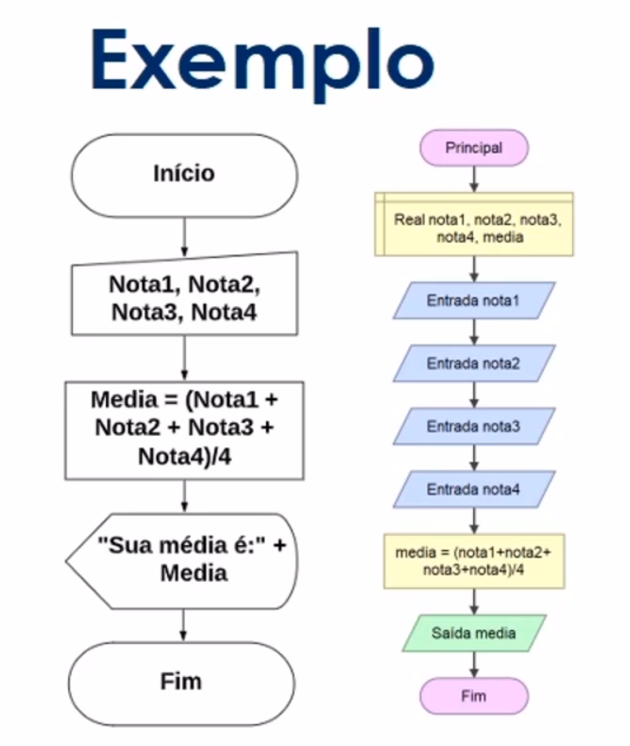

# :back: [Introdução à lógica de programação](../../../README.md#fundamentos-da-programação)

## Abstração
Abstração é a habilidade de concentrar nos aspectos essenciais de um contexte qualquer, ignorando características menos importantes ou acidentais, ou seja, nada mais é que abordar um problema extenso da forma mais simples possível.

## Algorítimos
É uma sequência de passos para resolver um problema.

## Pseudocódigo
É uma forma genérica de escrever um algoritmo, utilizando uma linguagem simples, como a linguagem falada ou escrita nativamente, de forma que possa ser entendida por qualquer pessoa, ou seja, é como escrever num papel qualquer o passo-a-passo das tarefas a serem feitas durante o dia por exemplo.

## Fluxograma
Sendo uma ferramenta, o fluxograma, é utilizada para representar graficamente o algoritmo, isto é, a sequência lógica e coerente do **fluxo de dados**. Pode ser visto como um tipo de diagrama e pode ser entendido como uma representação esquemática de um processo. Podemos entendê-lo, na prática, como a documentação dos passos necessários para a execução de um processo qualquer.

## Variáveis
É um objeto (uma posição, frequentemente localizada na memória) capaz de reter e representar um valor ou expressão. Também pode ser visto como um espaço na memória do computador destinado a um dado que é alterado durante a execução do algorítmo. 
Existem quatro tipos básicos de variáveis:
-   Numéricas
-   Caracteres
-   Alfanuméricas
-   Lógicas

## Constantes
São valores imutáveis, ou seja, não são alterados durante a vida útil do programa.

## Expressões aritméticas
São expressões que utilizam operadores aritméticos e funções aritméticas envolvendo constantes e variáveis.
| Operação | operador |
| :-: | :-: |
| Soma | + |
| Subtração | - |
| Multiplicação | * |
| Divisão | / |
| Potenciação | ^ |
| Porcentagem | % |

## Expressões literais
São expressões com contantes e/ou variáveis que tem como resultado valores literais. É util para a atribuição de valor para uma variável ou constante.
| Variável e/ou Constante | Valor da variável |
| :-: | :-: |
| A | 2 |
| B | 3 |
| C | A + B |

## Expressões relacionais
São expressões compostas por outras expressões ou variáveis númericas com operadores relacionais. As expressões relacionais retornam valores lógicos "verdadeiro" ou "falso".
Os operadores relacionais mais comuns são:
| Símbolo | Nome do operador | Exemplo | Significado |
| :-: | :-: | :-: | :-: |
| > | maior que | x > y | x é maior que y? |
| >= | maior ou igual | x >= y | x é maior ou igual a y? |
| < | menor que | x < y | x é menor que y? |
| <= | menor ou igual | x <= y | x é menor ou igual a y? |
| = | atribuição | x = y | atribui o valor de x à y, não é um operador lógico. |
| == | igual | x == y | x é igual a y? |
| === | igual e do mesmo tipo | x === y | x é igual e do mesmo tipo que y? |
| != | diferente | x != y | x é diferente de y? |
| <> | diferente | x <> y | x é diferente de y? |

## Tomadas de decisão
Ocorre quando uma ou mais condições determinam qual será o próximo passo a seguir. 

## Concatenação
É a operação de unir dois ou mais conteúdos do tipo "string".

## Estrutura de repetição
É uma estrutura que permite excutar mais de uma vez o mesmo comando ou conjunto de comandos, de acordo com uma condição ou com um **contador**.

