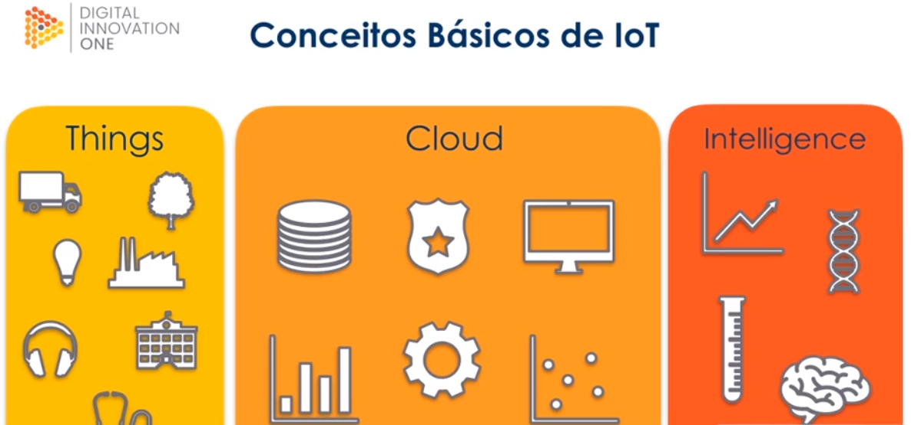

# :back: [README](../../../README.md#web-development)

<h1 align="center">
    Internet of things (Iot)
</h1> 

 

# Introdução
A internet das coisas tem o propósito de:
-   Embutir sensores em objetos do dia-a-dia.
-   Coletar dados dos sensores.
-   Usar o dado para tomar decisão.

A internet das coisas passa por trẽs fazes:
-   **As coisas** (Onde coletamos dados)
-   **A nuvem** (Onde armazenamos os dados)
-   **A inteligência** (Onde utilizamos os dados para um propósito)

 Exemplo de iot:

## Computação ubíqua
São tecnologias que se integram à vida do dia-a-dia, ao nosso cotidiano, até serem indistinguíveis dele.

 
 
