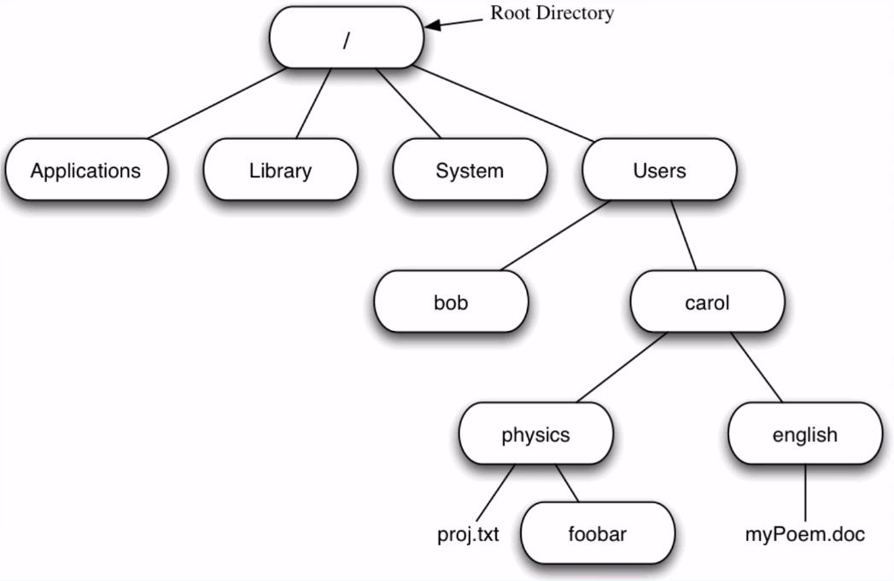
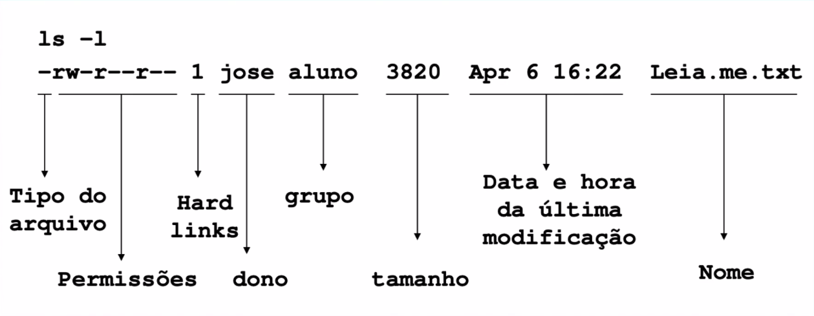

# :back: [README](../../../README.md#low-level-programming)

<h1 align="center">
    Unix
</h1> 

 

# Introdução

Unix é um sistema operacional. É cosiderado como base de muitos sistemas operacionais existentes. Foi criado utilizando a linguagem de programação C.

O Unix é montado em basicamente três níveis (camadas):

1. Kernel
    - É o **núcleo do sistema operacional** responsável por fazer a interação entre Hardware e software. Ele administra as principais funções dentro de um sistema operacional (CPU, Memory, Devices), incluindo o gerenciamento de **memória**, **processos** e **arquivos**.
2. Shell
    - É a interface entre o **Sistema Oparacional** (Unix) --> **Usuário** (Você) --> **Núcleo do sistema** (Kernel).
    - Em geral o Shell utiliza uma interface de:
        - Linha de comando (Command Line Interface)
        - Gráfica de usuário (Graphic User Interface)

            \* A interface gráfica roda comandos shell por baixo dos panos.
            
    - A função do shell é ler a linha de comando, interpretar o significado, executar o comando e devolver o resultado para o usuário.

        \* Muitos desenvolvedores chamam os comandos shell de programas, justamente pelas características acima. Desta forma, ao digitar e enviar o comando "mkdir" por exemplo, você está, na verdade, executando um programa que cria diretórios dentro sistema operacional.

    - Existem diversos tipos de shell, dentre eles:
        - SH
        - BASH
        - CSH
        - TCSH
        - ZSH
        - KSH

            \* Observe que todos terminam com SH, uma abreviação de Shell.    

3. Aplicativos
    - Aqui se encaixam os **softwares** que o usuário pode utilizar e a maioria dos **comandos** do unix.

## Processos
Tudo no Unix é um arquivo ou um processo. Tudo que é feito no Unix é um processo (tarefas, comandos, etc). Cada processo possui um identificador único chamado de PID (Proccess identifier).

O PID carrega informações sobre o processo, como:
* O usuário proprietário
* Sessão do shell
* Estado atual (Ativo, Suspenso, Aguardando)
* Linha de comando ulizada
* Outras informações

## Arquivos
Tudo no Unix é um arquivo ou um processo. No Unix tudo é um arquivo. Diretórios são arquivos, arquivos são arquivos e dispositívos são arquivos.

Sistemas de arquivo do Unix são organizados numa **hierarquia de raiz**. O nível mais alto deste sistema é o "/" ou "Root Directory".

Cada arquivo possui informações específicas, exemplo:

Exemplo de hierarquia e organização com arquivos no Unix:
* /
    - Diretório Raiz
* BOOT
    - Arquivos de configuração para inicialização
* BIN
    - Aplicativos binarios
* DEV
    - Arquivos do dispositivo
* ETC
    - Scripts de inicialização
* HOME
    - Diretórios Home para diferentes usuários
* PROC
    - Diretório dinâmico especial que mantem informações sobre o estado do sistema, incluindo os processos atualmente executados.
* ROOT
    - É o diretório Home do usuário Root
* SBIN
    - São os binários de sistema considerados importantes
* TMP
    - São os arquivos temporários
* USR
    - Aplicativos e arquivos que são, na maioria das vezes, disponíveis ao acesso de todos os usuários.
* VAR
    - São arquivos variáveis como logs e bancos de dados.
