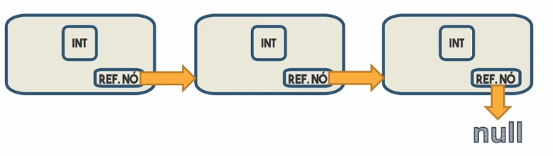
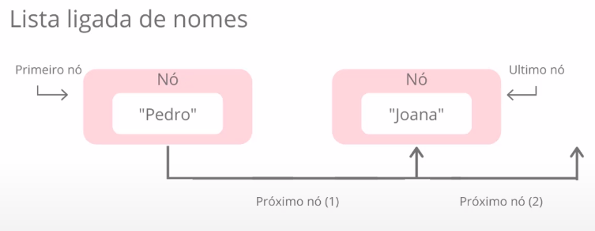
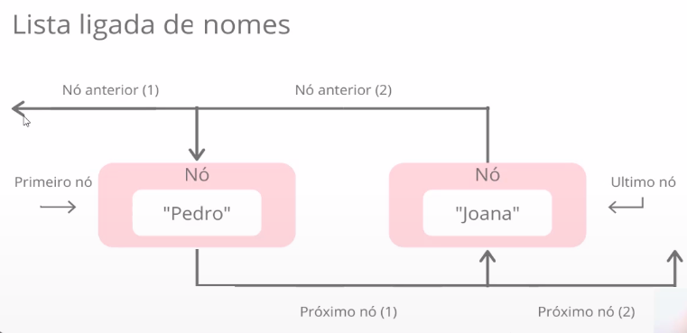
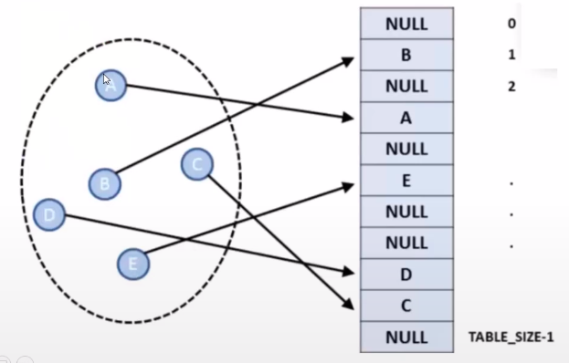
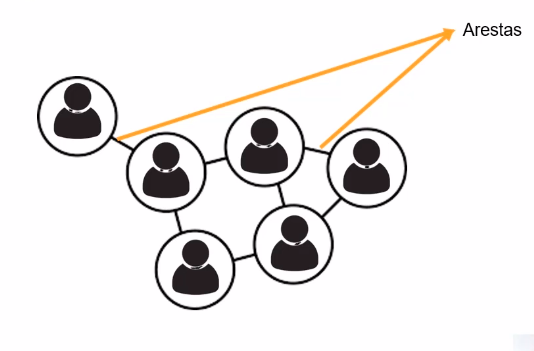

# :back: [README](../../../README.md#fundamentos-da-programação)

<h1 align="center">
    Estrutura de dados
</h1>

<br>

# Introdução
Estrutura de dados é uma estrutura organizada de dados na memória de um computador ou em qualquer dispositivo de armazenamento, de forma que os dados possam ser utilizados de forma correta, ou seja, é a forma como estruturamos os dados na memória do computador para utilizar os recursos disponíveis da melhor forma possível.

Estruturas de dados são mecanismos de organização de dados que atendem diferentes requisitos de processamento.

O site abaixo possui alguns exemplos de estruturas em portugol:
https://portugol-webstudio.cubos.io/

Os algoritmos são utilizados para manipular dados nas estruturas de várias formas, deste jeito é importante sabermos realizar um determinado conjunto de operações básicas, por exemplo:
-   inserir dados;
-   excluir dados;
-   Localizar um elemento;
-   Percorrer todos os itens constituintes da estrutura para visualização;
-   Classificar, que se resume em colocar os itens de dados em uma determinada ordem (numérica, alfabética, etc);

<br>
<br>

# Unidades de medida de dados

## bit
É uma **unidade de memória**.

<br>

## byte
É uma **unidade de informação digital** equivalente a oito bits.

Cada byte representa um único caractere de texto num computador. O byte representa letras, símbolos, números, sinais de pontuação, caracteres especiais etc. e codifica variadas informações numa máquina.

A codificação de caracteres denominada ASCII (American Standard Code for Information Interchange) adotou a informação de que 1 byte equivale a 8 bits, e usando a base binária (valores 0 ou 1), definiu 256 caracteres para representação de texto nos computadores, padronizando desta forma as operações entre diferentes dispositivos.

Para exprimir quantidades de dados, são usadas as seguintes medidas:

<div align="center">

| Medida | Sígla | Equivalencia |
| :-: | :-: | :- |
| 1 Byte | B | 8 bits |
| 1 kilobyte | KB | 1024 bytes |
| 1 megabyte | MB | 1024 kilobytes |
| 1 gigabyte | GB | 1024 megabytes |
| 1 terabyte | TB | 1024 gigabytes |
| 1 petabyte | PB | 1024 terabytes |
| 1 exabyte | EB | 1024 petabytes |
| 1 zettabyte | ZB | 1024 exabytes |
| 1 yottabyte | YB | 1024 zettabytes |

</div>


<br>
<br>

# Estruturas auxiliáres

## Nó
É um espaço em memória que armazena tanto o dado que "queremos" quanto uma referência para um próximo elemento, ou seja, um nó aponta para o próximo nó.

<br>

## Encadeamento de nó
Também chamado de alocação encadeada. Em uma estrutura de nó, é possível transitar para frente apenas.

Nós são estruturas simples e servem apenas como "envelopes". Quem realmente fará a administração destes dados são as **estruturas de dados**. 

<br>



<br>
<br>

# Tipos de estruturas de dados
As principais estruturas de dados utilizadas em algoritmos são:
-   Array (Vetores e Matrizes);
-   Registro;
-   Lista;
-   Pilha;
-   Fila;
-   Árvore;
-   Tabela Hash;
-   Grafos;

<br>
<br>

# Array
Vetores e Matrizes, ou simplesmente **Arrays**, são estruturas de dados simples que podem auxiliar quando há muitas variáveis do mesmo tipo em um algoritmo.

<br>

## Vetor
Um **Vetor** é  um **arrays uni-dimensional**, é também uma estrutura de dados indexada que pode armazenar uma quantidade determinada de valores do mesmo tipo, ou seja, nada mais é que uma **variável** que armazena várias variáveis do mesmo tipo.

<br>

### Declaração e alocação de vetores

Alocação estática:
```java
// todas declarações abaixo fazem, basicamente, a mesma coisa.

int v[]; // Declarando vetor 
v = new int[5]; // alocação de espaço para vetor

int v[] = new int[5]; // declaração combinada

int v = new int[5]; // declaração combinada

int v[] = {1, 2, 3, 4}; // declaração explícita
```

Alocação Variável:
```java
int n = 5; // tamanho do vetor
int v[] = new int[n]; // declaração e alocação de espaço para o vetor "v"
int i; // índice ou posição

// processando os "n" elementos do vetor "v"
for (i = 0; i < n; i++) {
  v[i] = i; // na i-ésima posição do vetor "v" armazena o valor da variável "i"
}
```

<br>

## Matriz
Uma **Matriz** pode ser um **array bi-dimensional**, **tri-dimensional**, **multi-dimensional**, etc.

<br>

### Declaração e alocação de matrizes
Declaração de matriz bi-dimensional:
```java
int matriz[][] = new int[2][4]; // matriz com 2 linhas X 4 colunas

/* OU */

int matriz[][] = new int[3][3]; // matriz quadrada: 3 linhas X 3 colunas
```
<br>
<hr> <!-- --------------------------------------------- -->
<br>

```java
// Fazer isso:

int matriz[][] = { {1, 2, 3}, {4, 5, 6}, {7, 8, 9} };

// É o mesmo que fazer isso:

int matriz[][] = {
        {1, 2, 3}, /* 1ª linha: */
        {4, 5, 6}, /* 2ª linha: */
        {7, 8, 9}  /* 3ª linha: */
    };

// Ou o mesmo que fazer isso:
/* 1ª linha: */
 matriz[0][0] = 1;
 matriz[0][1] = 2;
 matriz[0][2] = 3;

 /* 2ª linha: */
 matriz[1][0] = 4;
 matriz[1][1] = 5;
 matriz[1][2] = 6;

 /* 3ª linha: */
 matriz[2][0] = 7;
 matriz[2][1] = 8;
 matriz[2][2] = 9;
```

<br>
<hr> <!-- --------------------------------------------- -->
<br>

```java
// Linhas de diferentes tamanhos:
int matriz[][] = new int[2][];  // cria 2 linhas

 matriz[0] = new int[5];  // cria 5 colunas para a linha 0
 matriz[1] = new int[3];  // cria 3 colunas para a linha 1

 int matriz[][] = { 
        {1, 2}, 
        {4, 5, 6, 7, 8}, 
        {9, 10, 11} 
    };
```

<br>
<br>

# Registros
Enquanto arrays nos permitem armazenar vários dados de um único tipo de dados, o recurso de registro nos permite armazenar mais de um tipo de dado.

Um registro é composto por campos que especificam cada uma das informações que o compõem.

Exemplo, registro "pessoa":
| Campo | Informação |
| :-: | :-: |
| cpf | 111-777-888-22 |
| nome | Alberto Roberto |
| endereço | Rua Augusta |
| contato | +55(011)98888-6666 |

Toda estrutura de um registro tem um nome (ex.: pessoa), e seus campos (ex.: nome) podem ser acessados por meio do uso do operador ponto ( . ). Por exemplo, para acessar o nome de uma pessoa, poderíamos utilizar a seguinte declaração: 

**pessoa.nome**

<br><br>

# Listas
A diferença entre listas e arrays é a de que as listas possuem tamanho ajustável, enquanto arrays possuem tamanho fixo.

<br>

## Lista de estrutura ligada
Na estutura do tipo lista existem os nós (veja os nós como os índices dos vetores) onde cada um dos nós conece o valor que está sendo armazenado em seu interior além de conhecer o elemento posterior a ele: por isso ela é chamada de "lista ligada", pois os nós são amaarados com essa indicação de qual é o próximo nó.

 

## Lista de estrutura duplamente ligada
A grande diferença das listas duplamente ligadas para as listas ligadas é que elas são bidirecionais. Vimos que, naturalmente, não conseguimos "andar para trás" em listas ligadas, pois os nós de uma lista ligada sabem somente quem é o próximo elemento. Nas listas duplamente ligadas, os nós sabem quem é o próximo elemento e também sabem quem é o elemento anterior, o que permite a navegação reversa.



<br><br>

# Pilhas / Stack / Empilhamento
Uma pilha é uma estrutura de dados que serve como uma coleção de elementos e permite o acesso a somente um item de dados armazenado.

O acesso aos itens de uma pilha é restrito, ou seja, somente um item pode ser lido ou removido por vez.

<br>

## LIFO (Last In Fist Out )
Em português UEPS (Último a Entrar é o Primeiro a Sair), apresenta o seguinte critério: o primeiro elemento a ser retirado é o último que tiver sido inserido.

<br>

## FIFO (Fist In Fist Out )
Em português PEPS (Primeiro a Entrar é o Primeiro a Sair), apresenta o seguinte critério: o primeiro elemento a ser retirado é o primeiro que tiver sido inserido.

<br>
<br>

## Método Top

## Método Pop

## Método Push

## Método isEmpty
Informa se a pilha está vazia.

# Fila
A estrutura do tipo fila admite remoção de elementos e inserção de novos sujeita à seguinte regra de operação:
-   O elemento remodivo é o que está na estrutura há mais tempo, ou seja, o primeiro objeto inserido na fila é também o primeiro a ser removido seguindo o conceito FIFO.

<br><br>

# Árvores
É uma estrutura de dados que organiza seus elementos de forma hierárquica, onde existe um elemento que fica no topo da árvore, chamado de raiz, e existem os elementos subordinados à ele, que são chamados de nós ou folhas.  

<br><br>

# Tabela hash
Uma tabela hash, de dispersão ou espalhamento é uma estrutura de dados especial, que associa chaves de pesquisa a valores.

Uma tabela hash é uma generalização da idéia de array, porém utiliza uma função denominada **Hashing** para espalhar os elementos, fazendo com que os mesmo fiquem de forma não ordenada dentro do "array" que define a tabela.

Exemplo:



A tabela acima permite que noós associemos "valores" a "chaves".

Valor: É a posição ou índice onde o elemento se encontra.
Chave: Parte da informação que compõe o elemento a ser manipulado.

Dessa forma espalhar facilita a busca na estrutura de dados, pois a partir de uma chave podemos acessar de forma rápida uma posição do "array".

<br><br>

# Gráfos
São estruturas que permitem programar a relação entre objetos. Os objetos são vértices ou "nós" do grafo. Os relacionamentos são arestas.



<br><br>


# Generics
Serve para:
-   Evitar casting excessivo;
-   Evitar códigos redundantes;
-   Encontrar erros em tempo de compilação;
-   Introduzido desde o Java SE 5.0

Exemplo:
```java
Lista<String> minhaLista = new Lista<>();

public class Lista<T>{
    private T t;
    ...
}

```

<br>
<br>

## Wildcards
-   Unknown Wildcards (Unbounded)
-   Bounded Wildcard (Upper Bounded / Lower Bounded)

## Unknown Wildcards
Exemplo:
```java
// Imprime uma lista de qualquer tipo
public void imprimeLista (List<?> lista) {
    for(Object obj : lista){
        System.out.println(obj);
    }
}

List<Aluno> minhaLista = new List<Aluno>();
imprimeLista(minhaLista);

```

## Upper Bounded Wildcards
Exemplo:
```java
// Só é possivel passar listas de Pessoa e hedeiros de Pessoa 
public void imprimeLista (List<? extends Pessoa> listaPessoas) {
    for(Pessoa p : listaPessoas){
        System.out.println(p);
    }
}

List<Aluno> minhaLista = new List<Aluno>();
imprimeLista(minhaLista);

```

## Lower Bounded Wildcards
Exemplo:
```java
// Não aceita hedeiros da classe Pessoa, apenas da classe Pessoa "para cima". 
public void imprimeLista (List<? super Pessoa> listaPessoas) {
    for(Pessoa p : listaPessoas){
        System.out.println(p);
    }
}

List<Aluno> minhaLista = new List<Aluno>();
imprimeLista(minhaLista);

```

## Convenção para Siglas
-   k para "Key":
    -   `Map<K,V>`
-   V para "Value":
    -   `Map<k,V>`
-   E para "Element":
    -   `List<E>`
-   T para "Type":
    -   `List<T>`
    -   Collections#addAll
-   ? para genérico

<br>
<br>
