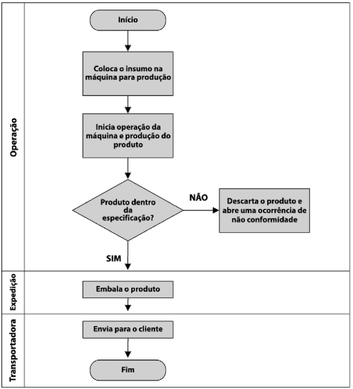

# :back: [README](../../../README.md#programming-fundamentals)
# :back: [LDP - Intro](intro.md#fluxograma)

<h1 align="center">
    Introdução à lógica de programação
</h1> 

 

# Fluxograma
Sendo uma ferramenta, o fluxograma, é utilizada para representar graficamente o algoritmo, isto é, a sequência lógica e coerente do **fluxo de dados**. Pode ser visto como um tipo de diagrama e pode ser entendido como uma representação esquemática de um processo. Podemos entendê-lo, na prática, como a documentação dos passos necessários para a execução de um processo qualquer.

 

## Links interessantes:
-   https://www.conceptdraw.com/How-To-Guide/flow-chart-symbols

 

## Operação
| Símbolo | Nome | Descrição |
| :-: | :-: | :-: |
|  | Começo e fim | Indica o começo ou fim de um processo . |
|  | Processo / Atividade | Mostra uma etapa do processo. Este é o símbolo mais comum nos fluxogramas. |
|  | Processo pré-definido | Indica outra etapa do processo que está descrita em outro lugar. |
|  | Processo alternativo | Usado quando a atividade é uma alternativa a atividade normal. |
|  | Espera / Atraso | Representa qualquer período de espera que fizer parte do processo. |
|  | Preparação | Representa uma configuração para outra etapa do processo: algo deve ser feito, ajustado ou modificado antes de prosseguir o processo. |
|  | Operação manual | Indica as etapas que não são automatizadas e que vão se repetir até que seja parada manualmente. |

 

## Ramificação e controle do fluxo

| Símbolo | Nome | Descrição |
| :-: | :-: | :-: |
|  | Fluxo de linha	 | Conectores de símbolos que mostram a direção que corre o processo. |
|  | Terminação | Mostra os pontos de início e fim de um processo. |
|  | Decisão | Indica um ponto de decisão do processo,  apresentando duas possibilidades de caminhos para o fluxo de acordo com as condições estipuladas na decisão. |
|  | Conector | É utilizado como conector para ligar um ponto ao outro no fluxo, normalmente identificados com letras maiúsculas (A , BB) |
|  | Conector fora de página	 | Mostra a continuação do processo para outro processo desenhado em outra página. |
|  | Mesclar | Representa a fusão de vários processos ou informações em um só. |
|  | Extrair | Mostra quando um processo divide-se em caminhos paralelos. |
|  | Ou | Indica que o fluxo do processo continua em duas ou mais direções. |
|  | Somador | Representa a etapa em que vários passos convergem em um único processo. |

 

## Entrada e saída

| Símbolo | Nome | Descrição |
| :-: | :-: | :-: |
|  | Dados (I/O) | Indica as entradas e saídas do processo. |
|  | Documento | Mostra um processo que gera um documento. |
|  | Vários documentos | Mostra um processo que gera vários documentos. |
|  | Exibição | Indica um passo do processo onde a informação é exibida para uma pessoa. |
|  | Entrada manual | Representa a etapa em que uma pessoa deve inserir informações manuais. |

 

## Armazenamento de arquivos e informações 

| Símbolo | Nome | Descrição |
| :-: | :-: | :-: |
|  | Dados armazenados | Indica uma etapa onde os dados são armazenados. |

 

## Processamento de dados

| Símbolo | Nome | Descrição |
| :-: | :-: | :-: |
|  | Agrupar | Indica uma etapa e que os dados devem ser organizados de uma forma padrão. |
|  | Classificar | Representa uma etapa do processo em que os dados devem ser classificados em uma ordem pré-definida. |

  

# Tipos de fluxograma

## Fluxograma de processo simples
É um diagrama de blocos que contém pontos de decisão. Indica a sequencia de funcionamento em processos simples, que depende de uma condição para executar um tipo de tarefa.

 

 

## Fluxograma funcional
Mostra a sequência de atividades de um processo entre as áreas ou seções por onde ele acontece. É muito útil para processos transversais, que passam por diversas áreas até ser concluído. Nele se inclui também os responsáveis pelos setores e pode até indicar gargalos no processo.

 

  

