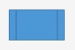
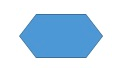
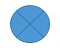

# :back: [Introdução à lógica de programação](../../../README.md#fundamentos-da-programação)

 

# Algoritmos
Em lógica de programação, um algoritmo é uma sequência de passos para resolver um problema.

 

## Abstração
Abstração é a habilidade de concentrar nos aspectos essenciais de um contexte qualquer, ignorando características menos importantes ou acidentais, ou seja, nada mais é que abordar um problema extenso da forma mais simples possível.

 

## Pseudocódigo
É uma forma genérica de escrever um algoritmo, utilizando uma linguagem simples, como a linguagem falada ou escrita nativamente, de forma que possa ser entendida por qualquer pessoa, ou seja, é como escrever num papel qualquer o passo-a-passo das tarefas a serem feitas durante o dia por exemplo.

  

# Fluxograma
Sendo uma ferramenta, o fluxograma, é utilizada para representar graficamente o algoritmo, isto é, a sequência lógica e coerente do **fluxo de dados**. Pode ser visto como um tipo de diagrama e pode ser entendido como uma representação esquemática de um processo. Podemos entendê-lo, na prática, como a documentação dos passos necessários para a execução de um processo qualquer.

 

## Links interessantes:
-   https://www.conceptdraw.com/How-To-Guide/flow-chart-symbols

 

## Operação
| Símbolo | Nome | Descrição |
| :-: | :-: | :-: |
|  | Começo e fim | Indica o começo ou fim de um processo . |
|  | Processo / Atividade | Mostra uma etapa do processo. Este é o símbolo mais comum nos fluxogramas. |
|  | Processo pré-definido | Indica outra etapa do processo que está descrita em outro lugar. |
|  | Processo alternativo | Usado quando a atividade é uma alternativa a atividade normal. |
|  | Espera / Atraso | Representa qualquer período de espera que fizer parte do processo. |
|  | Preparação | Representa uma configuração para outra etapa do processo: algo deve ser feito, ajustado ou modificado antes de prosseguir o processo. |
|  | Operação manual | Indica as etapas que não são automatizadas e que vão se repetir até que seja parada manualmente. |

 

## Ramificação e controle do fluxo

| Símbolo | Nome | Descrição |
| :-: | :-: | :-: |
|  | Fluxo de linha	 | Conectores de símbolos que mostram a direção que corre o processo. |
|  | Terminação | Mostra os pontos de início e fim de um processo. |
|  | Decisão | Indica um ponto de decisão do processo,  apresentando duas possibilidades de caminhos para o fluxo de acordo com as condições estipuladas na decisão. |
|  | Conector | É utilizado como conector para ligar um ponto ao outro no fluxo, normalmente identificados com letras maiúsculas (A , BB) |
|  | Conector fora de página	 | Mostra a continuação do processo para outro processo desenhado em outra página. |
|  | Mesclar | Representa a fusão de vários processos ou informações em um só. |
|  | Extrair | Mostra quando um processo divide-se em caminhos paralelos. |
|  | Ou | Indica que o fluxo do processo continua em duas ou mais direções. |
|  | Somador | Representa a etapa em que vários passos convergem em um único processo. |

 

## Entrada e saída

| Símbolo | Nome | Descrição |
| :-: | :-: | :-: |
|  | Dados (I/O) | Indica as entradas e saídas do processo. |
|  | Documento | Mostra um processo que gera um documento. |
|  | Vários documentos | Mostra um processo que gera vários documentos. |
|  | Exibição | Indica um passo do processo onde a informação é exibida para uma pessoa. |
|  | Entrada manual | Representa a etapa em que uma pessoa deve inserir informações manuais. |

 

## Armazenamento de arquivos e informações 

| Símbolo | Nome | Descrição |
| :-: | :-: | :-: |
|  | Dados armazenados | Indica uma etapa onde os dados são armazenados. |

 

## Processamento de dados

| Símbolo | Nome | Descrição |
| :-: | :-: | :-: |
|  | Agrupar | Indica uma etapa e que os dados devem ser organizados de uma forma padrão. |
|  | Classificar | Representa uma etapa do processo em que os dados devem ser classificados em uma ordem pré-definida. |

  

# Tipos de fluxograma

## Fluxograma de processo simples
É um diagrama de blocos que contém pontos de decisão. Indica a sequencia de funcionamento em processos simples, que depende de uma condição para executar um tipo de tarefa.

 

 

## Fluxograma funcional
Mostra a sequência de atividades de um processo entre as áreas ou seções por onde ele acontece. É muito útil para processos transversais, que passam por diversas áreas até ser concluído. Nele se inclui também os responsáveis pelos setores e pode até indicar gargalos no processo.

 

  

# Objeto
É uma posição, frequentemente localizada na memória, capaz de reter e representar um valor ou expressão, ou seja, 
objetos são elementos instanciados (criados) na memória durante a execução do programa ou processo.

 

## Variável
É um objeto que é alterado durante a execução do algorítmo, ou seja, é um espaço na memória do computador destinado a um dado que irá variar durante sua execução.

Existem quatro tipos básicos de variáveis:
-   Numéricas
-   Caracteres
-   Alfanuméricas
-   Lógicas

 

## Constante
São valores imutáveis, ou seja, não serão alterados durante a vida útil do programa.

 

## Vetor
**Vetor** é uma **coleção** de variáveis do mesmo tipo, acessíveis com um único nome e armazenadas igualmente na memória.

A individualização de cada variável de um vetor é feita através de uso de **índices**.

-   Vetor[5];
    - 6 linhas, de 0 à 5.
    - 6 posições.

    | Índices |
    | :-: |
    | [0] |
    | [1] |
    | [2] |
    | [3] |
    | [4] |
    | [5] |

 

## Matriz
As **Matrizes** são vetores de uma mais de uma dimensão.
-   Matriz[5][3]; (Matriz bi-dimensional, 4 por 6)
    - 6 linhas, de 0 à 5.
    - 4 colunas, de 0 à 3.
    - 24 posições.

    | Índices |
    | :-: |
    | [0,0] [0,1] [0,2] [0,3] |
    | [1,0] [1,1] [1,2] [1,3] |
    | [2,0] [2,1] [2,2] [2,3] |
    | [3,0] [3,1] [3,2] [3,3] |
    | [4,0] [4,1] [4,2] [4,3] |
    | [5,0] [5,1] [5,2] [5,3] |

 

## Concatenação
É a operação de unir dois ou mais conteúdos do tipo "string".

  

# Expressões

 

## Expressões aritméticas
São expressões que utilizam operadores aritméticos e funções aritméticas envolvendo constantes e variáveis.
| Operação | operador |
| :-: | :-: |
| Soma | + |
| Subtração | - |
| Multiplicação | * |
| Divisão | / |
| Potenciação | ^ |
| Porcentagem | % |

 

## Expressões literais
São expressões com contantes e/ou variáveis que tem como resultado valores literais. É util para a atribuição de valor para uma variável ou constante.
| Variável e/ou Constante | Valor da variável |
| :-: | :-: |
| A | 2 |
| B | 3 |
| C | A + B |

 

## Expressões relacionais
São expressões compostas por outras expressões ou variáveis númericas com operadores relacionais. As expressões relacionais retornam valores lógicos "verdadeiro" ou "falso".
Os operadores relacionais mais comuns são:
| Símbolo | Nome do operador | Exemplo | Significado |
| :-: | :-: | :-: | :-: |
| > | maior que | x > y | x é maior que y? |
| >= | maior ou igual | x >= y | x é maior ou igual a y? |
| < | menor que | x < y | x é menor que y? |
| <= | menor ou igual | x <= y | x é menor ou igual a y? |
| = | atribuição | x = y | atribui o valor de x à y, não é um operador lógico. |
| == | igual | x == y | x é igual a y? |
| === | igual e do mesmo tipo | x === y | x é igual e do mesmo tipo que y? |
| != | diferente | x != y | x é diferente de y? |
| <> | diferente | x <> y | x é diferente de y? |

 

## Tomadas de decisão
Ocorre quando uma ou mais condições determinam qual será o próximo passo a seguir. 
Abaixo alguns tipos de tomada de decisão:
| Nome | exemplo | Significado |
| :-: | :-: | :-: |
| switch | switch ( numero ){ case 1: x = 1; break; case 2: x = 2; break; default: x = 0; break; } return x; | "interruptor" : "caso" 1, faça: x igual a 1 e "saia do switch" ; "caso" 2, faça: x igual a 2 e "saia do switch" ; "caso" nenhum dos casos anteriores, faça: x igual a zero e "saia do switch"; "retorne" o valor de x; |
| if else | if( x > 3 ){ y = verdadeiro } else{ y = falso } | "se" : "se" x é maior que 3 então y é igual a "verdadeiro". "se não" então y é igual a falso.  |

 

## Estrutura de repetição
També conhecido como **laço de repetição**, é uma estrutura que permite excutar mais de uma vez o mesmo comando ou conjunto de comandos, de acordo com uma condição ou com um **contador**.

Abaixo alguns tipos de estruturas de repetição:
| Nome | Exemplo | Significado |
| :-: | :-: | :-: |
| while | while( x < y ){ x = x + 1 } | "Enquanto" x é menor que y, faça: x é iguai a x mais 1 |
| for | for( int i = 0 ; i < 1000 ; i + 1 ){ println( i ) } | "para" i igual a zero; enquanto i for menor que 1000; some 1 ao i. Faça: "escreva" o valor de i na tela. |
