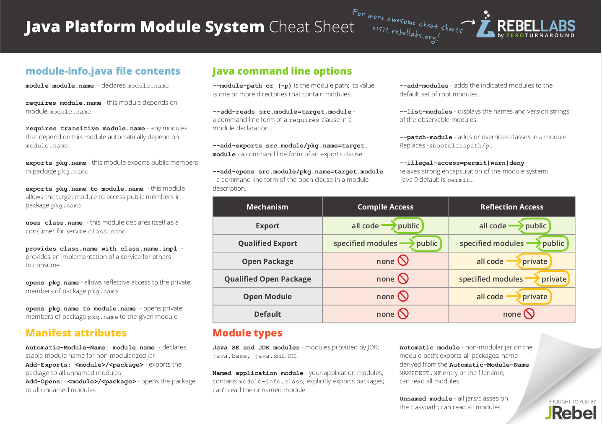

# :back: [README](../../../README.md#programming-languages)

<h1 align="center">
    Comandos - Java
</h1> 

# Módulos Java

Link: https://files.jrebel.com/pdf/RebelLabs-Java-9-modules-cheat-sheet.pdf

> Existe diferença entre **modulos de projeto** e **Java Modules**.

# Comandos básicos

| Comando | Exemplo | Descrição |
| :-: | :-: | :-: |
| javac | `javac hello.java` | Compila um código Java para um bytecode. Neste caso, ele pegará o arquivo `hello.java` e compilará no arquivo `hello.class` |
| java | `java hello` | Executa arquivos java. Neste caso, executa o arquivo `hello.class`. |

 
 