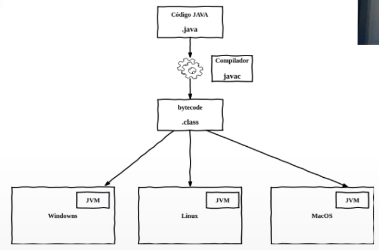
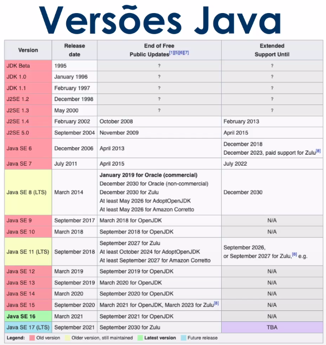

# :back: [README](../../../README.md#programming-languages)

<h1 align="center">
    Introdução - Java
</h1>

# O que é Java?
Java é uma linguagem de programação de propósito-geral, compilada e interpretada. Possui um grande número de recursos que a torna adequada para a web.

Java é uma **plataforma** e uma **linguagem de programação**. Pode ser utilizada para desenvolver aplicações **standalone** ou **distributed**. 

Enquanto **plataforma**, o Java possui a JRE (Java Runtime Environment) que é um ambiente de software onde os programas podem rodar.

Enquanto **Linguagem**, o Java é um linguagem de alto-nível, robusta, orientada à objetos, case sensitive.

Por se tratar de uma linguagem orientada à objetos, o Java trata tudo como objeto.

Diferentes de outras linguagens de programação, que são **compiladas** para **código nativo** ainda em tempo de desenvolvimento, a linguagem Java é **compilada** para um **bytecode** e **interpretado** por uma **máquina virtual** (JVM), o que faz do Java uma linguagem **compilada** e **interpretada**.

 
 

# Vantagens
O Java, inicialmente, veio para oferecer vantagens que o C++ não entregava, dentre eleas temos:
-   **Segurança**: Em Java não há perigo em ler uma informação falsa ao, acidentalmente, exceder o tamanho de um array.
-   **Gerenciamento automático de memória**: Um desenvolvedor Java não precisa ter que checar se existe espaço suficiente alocado em memória para um objeto ou desalocar espaço explicitamente. As operações são manipuladas automaticamente pelo garbage collector. Isso também significa que ponteiros não são necessários.
-   **Simplicidade**: Não há ponteiros, uniões, modelos, estruturas. Quase tudo em Java pode ser declarado como uma classe. Toda confusão por utilizar herança multipla é evitada pois o Java não dá suporte a este tipo de recurso.
-   **Suporte para excução de Multithread**: Imagine um tecido, as linhas são as threads. Java foi projetado desde o início para suportar o desenvolvimento de softwares Multitrhead.
-   **Portabilidade**: O lema Java é *"Escreva uma vez, rode em todo lugar"*. Isso é possível graças a JVM.

 
 

# Compilador Javac
O compilador java chamasse **javac**. Ele é o responsável por transformar o `código java` em `bytecode`. 

Um compilador é um **programa** que, a partir de um **código fonte**, cria um programa semanticamente equivalente, porém escrito em outra linguagem, **código objeto**. Um compilador traduz um programa de uma linguagem textual para um linguagem de máquina, específica para um processador e sistema operacional.

O nome **compilador** é usado principalmente para os programas que **traduzem** o **código fonte** de uma `linguagem de programação de alto nível` para uma `linguagem de programação de baixo nível` (por exemplo, **Assembly** ou **código de máquina**).

> Uma vez compilado o código java e assim transformado em bytecode, podemos executar este em qualquer tipo de sistema operacional, ou seja, o bytecode é **plataform-independent**.

 
 

# Bytecode
É o **código originado** da compilação de programas **Java**.

O **bytecode** é o programa interpretado e executado pela **máquina virtual Java** (JVM).

 
 

# JVM (Java Virtual Machine)
Primeiramente, uma **Virtual Machine** (VM), ou máquina virtual, é um software que simula uma máquina física e consegue executar vários programas, gerenciar processos, memória e arquivos. Tudo isso faz parte de uma plataforma com memória, processador e outros recursos totalmente virtuais, sem dependência do hardware. 

Já a JVM é a máquina virtual do Java, responsável por executar o bytecode (.class).

Em linguagens compiladas diretamente para um sistema operacional (SO) específico, esse programa não irá executar em outro SO, havendo a necessidade de compilar uma versão do software para cada SO.

Com o Java compilaremos para um bytecode que será executado pela máquina virtual JVM e não diretamente para o SO, assim, o software escrito em java possui portabilidade para qualquer sistema operacional, porém, cada JVM deve ser construída para um SO específico.

 
 

# JRE (Java Runtime Environment)
É o ambiente **mínimo** de execução do Java. Ele fornece as bibliotecas padrões do Java para o JDK compilar o seu código e para a JVM executar o seu programa, ou seja, o JRE é composto pelo JVM, bibliotecas, APIs java e outros componentes para suporte a plataforma java.

 
 

# JDK (Java Development Kit)
É o kit de desenvolvimento Java responsável por compilar o código-fonte (.java), através do compilador javac, em um bite code (.class). O JDK é composto pelo compilador java (javac), bibliotecas da linguagem, ferramentas e JRE.

**Obs.:** O JDK é um conjunto de ferramentas para desenvolver programas baseados em Java e este ambiente é voltado para os desenvolvedores. Ou seja, a JDK faz parte do funcionamento das IDE's que auxiliam no desenvolvimento em Java, por exemplo o IntelliJ, Eclipse, NetBeans, VSCode entre outros.

 
 

# Visão geral

 
 

# Fases de execução de um programa Java

1. Escrevemos o seu código-fonte (arquivo com extensão .java)
2. Utilizamos o JDK (Java Development Kit) para compilar os seu código-fonte e gerar o arquivo bytecode (arquivo com extensão .class)
3. Para executar o seu programa, a JVM (Java Virtual Machine) lê o arquivo compilado (.class) e as bibliotecas padrões do Java que estão no JRE (Java Runtime Environment).

 

 
 

# Ciclo de vida de uma aplicação Java

 
 

# Versões Java
Existem várias, mas as duas principais são:
-   OpenJDK
-   JDK Oracle

 

## OpenJDK
É open source (GNU - General Public License), tem suporte de longo prazo (LTS) e, normalmente, uma versão LTS nova é lançada a cada quatro anos.
-   A cada lançamento de LTS é que algumas funcionalidades são adicionadas ou retiradas.
-   As versões intermédiárias, entre uma LTS e outra LTS, são chamadas de Beta.
-   As empresas, lógicamente, utilizam as versões LTS.

 

## JDK Oracle
Requer licensa comercial sob contrato de Licença de Código Binário Oracle.

 
 

# IDE's Java
É fortemente indicado que utilizemos IDE's própria para a linguagem que estamos trabalhando, dessa forma existem algumas IDE's que são desenvolvidas especificamente para o desenvolvimento na linguagem Java, são elas:
-   Eclipse
-   IntelliJ IDEA

 

## Eclipse
É uma IDE para desenvolvimento Java, porém suporta várias outras linguagens. Ele foi feito em Java e segue o modelo open source de desenvolvimento de software.

 

## IntelliJ IDEA
É uma IDE escrita em Java para o desenvolvimento de software de computador. Está disponível como uma edição da comunidade licenciada Apache 2 e em uma edição comercial proprietária.

 
 

# JShell
A Java Shell Tool (JShell) é uma ferramenta interativa para o aprendizado da linguagem programação Java e prototipação de código Java. 

Por definição é uma Read-Eval-Print Loop (REPL), que avalia declarações, instruções e expressões à medida que são inseridas e, em seguida, mostra imediatamente os resultados.

Para utilizar o Jshell basta ter o java configurado na máquina e então abrir o terminal e digitar "jshell".

Para ver tudo o que o jshell está fazendo basta acioná-lo pelo modo verboso "jshell -v".

Para ver todas as variáveis disponíveis na sessão atual digite "/vars".

Para salvar as entradas basta fazer "/save [filename.java]".

Para abrir uma nova sessão basta fazer "/open arquivo.java"

Para sair do jshel basta digitar "/exit".

