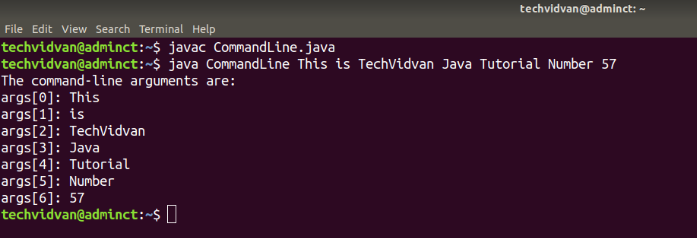

# :back: [README](../../../README.md#programming-languages)

<h1 align="center">
   Métodos - Java 
</h1>

Em Java, métodos são utilizados para agrupar um conjunto (set) de instruções com o propósito de desempenhar a mesma função. 

<br>

# Criando Métodos

Sintáxe:

```java
public static int method_Name(int x, int y) {
    // method body
}
```

> `public` é um modificador de acesso.

> `static` define o tipo do método. (É opcional)

> `int` define o tipo do dado que será retornado pelo método.

> `method_Name` define o nome do método.

> `int x`, `int y` define os parâmetros que o método deverá receber e seus respectivos tipos de dado.

<br>
<br>

# Chamando Métodos
Após definir um métodos, só poderemos utilizá-lo por meio de uma chamada. Uma vez que um método é chamado por um programa, este método passa a ter o controle sobre esse programa. O controle só será devolvido ao programa sobre duas hipóteses:
1.  Quando o método retornar um valor;
2.  Quando atingir a linha que contém a chave de fechamento do método;

<br>
<br>

# A palavra-chave `void`
Esta é a palavra-chave que utilizamos para indicar que um método não retornará valor algum, ou seja, retornará "vazio".

<br>
<br>

# Chamada por valor
Como visto anteriormente, as **atribuições** em Java sempre serão por **cópia de valor**.

> Com tipo **primitivo**, copiamos **o valor em memória**.

> Com **objetos**, copiamos o valor da **referẽncia em memória**, sem duplicar o objeto, ou seja, ele aponta para o outro objeto.

<br>

Chamada ao método é um meio de invocar métodos Java. Quando fazemos uma chamada ao valor, o valor original não muda, veja abaixo:

Exemplo 1:

```java
public class Main
{
    public static class MethodCallExample {
        int p = 10;
        
        static void changeP(int p) {
            p = p + 10; // changes to/in local variable
        }
    }
    
	public static void main(String[] args) {
		MethodCallExample mc = new MethodCallExample();
		System.out.println("The initial value is " + mc.p); // Imprime: The initial value is 10 
		mc.changeP(50);
		System.out.println("The new value is " + mc.p); // Imprime: The new value is 10
	}
}
```

> Java suporta **call-by-value**.

> Java **não** suporta call-by-reference. Numa chamada por referência, o valor original muda após fazermos uma chamada ao método.

<br>

Se em vez de passarmos um valor primitivo, passarmos um o objeto, o valor original mudará, veja abaixo:

Exemplo 2:

```java
public class Main
{
    public static class MethodCallExample {
        int p = 10;
        
        static void changeP(MethodCallExample meth) {
            meth.p = meth.p + 50; // change to instance variable
        }
    }
    
	public static void main(String[] args) {
		MethodCallExample mc = new MethodCallExample();
		System.out.println("The initial value is " + mc.p); // Imprime: The initial value is 10 
		mc.changeP(mc);
		System.out.println("The new value is " + mc.p); // Imprime: The new value is 60
	}
}
```

> A característica acima se dá ao fato de que, em Java, ao fazer referência à um objeto, fazemos uma cópia da sua posição na memória, ou seja, o objeto não é duplicado.

<br>
<br>

# Métodos Abstratos
Você pode declarar um método e então precisar que sua implementação seja finalizada numa classe filha. Assim, essa classe pai pode ser marcada como `abstract`. Para isso, adicione a palavra-chave `abstract` antes do nome do método. Métodos abstratos não têm o method body e após sua declaração só é preciso adicionar um ponto-e-vírgula ao seu final, observe abaixo:

Exemplo 1:

```java
public abstract class Worker {
    private String workerName;
    private String workerAddress;
    private int workerNumber;

    public abstract double getWage(); // Método abstrato
}
```

> Métodos abstratos não têm corpo.

> Métodos abstratos devem ser declarados dentro de classes abstratas.

<br>

Uma **Classe_A** deve **estender** uma **Classe_B** para poder **herdar** suas características e assim poder **implementar** os métodos abstratos dessa Classe_B. Veja abiaxo:

Exemplo 2:

```java
public class Wage extends Worker {
    private double wage;
    public double getWage() {
        System.out.println("Getting wage for " + getWorkerName());
        return wage/52;
    }
}
```

<br>
<br>

# Sobrecarga de Métodos (Method Overloading)
Isto ocorre quando temos dois ou mais métodos com o mesmo nome mas parâmetros diferentes. A diferênça de parâmetros pode ser em termos de número ou tipo. Exemplo:

```java
public class MethodOverloading {
    public static void main(String[] args) {
        int w = 11;
        int x = 6;
        int output1 = minimumFunction(w, x);
        System.out.println("The minimum value is " + output1);
        
        double y = 7.3;
        double z = 9.4;
        double output2 = minimumFunction(y, z);
        System.out.println("The minimum value is " + output2);
    }
    // for integer
    public static int minimumFunction(int p, int q) {
        int min;
        if(p > q) {
            min = q;
        }else{
            min = p;
        }
        return min;
    }
    // for double
    public static double minimumFunction(double p, double q) {
        double min;
        if(p > q) {
            min = q;
        }else{
            min = p;
        }
        return min;
    }
}
```

> Acima temos dusa funções com o mesmo nome `minimumFunction` e o motor Java irá escolher cada uma delas a depender dos parâmetros que passarmos. Conseguimos dessa forma a sobrecargo do método.

<br>
<br>

# Command-Line Arguments
As vezes será necessário passar informações para o programa durante sua execução. A melhor forma de fazê-lo é por meio da passagem de argumentos de linha de comando pelo método `main()`.

Observe o código abaixo:

```java
public static void main(String[] args) {
    // ...
}

// OU

public static void main(String args[]) {
    // ...
}
```

As `[]` idicam a existência de um array e por meio deste podemos passar argumentos para os nossos programas.

<br>

Abaixo vemos como isto é ocorre:

```java
// Arquivo chamado 'CommandLine.java'
class CommandLine {
    public static void main(String args[]) {
        System.out.println("The command-line arguments are: ");

        for (int x = 0; x < args.length; x++){
            System.out.println("args[" + x + "]: " + args[x]);
        }
    }
}
```

<br>

A saída seria como na imagem abaixo:



<br>
<br>

# A Palavra-Chave `this`
Esta é utilizada em Java para se referir ao objeto da classe atual, dentro de um construtor ou método de instância. O this pode ser utilizado para se referir a variáveis, métodos ou construtores. 

> O this é bastante útil na diferenciação entre variáveis locais e de instância quando estas têm nomes similares dentro do método ou construtor.

Exemplo 1:

```java
class Person {
    int age;
    Person(int age) {
        this.age = age;
    }
}
```

<br>

Veja abaixo como podemos acessar vários membros de uma classe através do this:

```java
public class Main{
    public static class This_Class {
        int x = 10;

        This_Class() {
            System.out.println("Here is a default constructor");
        }

        This_Class(int x) {
            this(); // Is the same as 'This_Class()' // Call to this must be first statement in constructor
            System.out.println("Here is a parametrized constructor");
            this.x = x; // Is the same as 'This_Class.x = x'
        }

        public void salute() {
            System.out.println("Welcome to Java Programming");
        }

        public void print() {
            int x = 20;
            System.out.println("Value of local variable num is : " + x);
            System.out.println("The instance variable x has a value of : " + this.x);
            this.salute(); // Is the same as 'This_Class.salute()'
        }
    }    

    public static void main(String[] args) {
        This_Class object1 = new This_Class();
        object1.print();
        System.out.println("After object1");
        /*
            Imprime:
            Here is a default constructor
            Value of local variable num is : 20
            The instance variable x has a value of : 10
            Welcome to Java Programming
            After object1
        */
        This_Class object2 = new This_Class(30);
        object2.print();
        System.out.println("After object2");
        /*
            Imprime:
            Here is a default constructor
            Here is a default constructor
            Value of local variable num is : 20
            The instance variable x has a value of : 30
            Welcome to Java Programming
            After object2
        */
    }    
}
```

> É interessante observar que, no código acima, ao criar o `object2` o programa chamou tanto o contrutor padrão quanto o contrutor parametrizado.

<br>
<br>

# Argumentos variáveis
Java permite passar um número variável de argumentos para um método, mas estes devem ser de um tipo similar.

Sintáxe:

```java
public method_name(type_name... parameter_name);
```

Quando declaramos o método, o tipo é especificado e seguido por elipses `(...)` . Você só pode especificar um parâmetro de comprimento variável em um método e o parâmetro deve ser o último parâmetro. Se houverem outros
parâmetros regulares, eles devem precedê-lo.

Exemplo 1:

```java
public class VariableArgumentsExample {
    public static void main(String args[]) {
        showMax(11, 23, 87, 78.5, 43); // Imprime: The maximum value is 87.0 
        showMax(new double[] {10, 22, 31}); // Imprime: The maximum value is 31.0
        showMax(); // Imprime: No argument were passed
    }
    public static void showMax(double... values) {
        if(values.length == 0) {
            System.out.println("No argument were passed");
            return;
        }

        double output = values[0];
        
        for(int x = 1; x < values.length; x++) {
            if(values[x] > output) {
                output = values[x];
            }
        }

        System.out.println("The maximum value is " + output);
    }
}
```

<br>

# Sobrescrita de método ( Method Overriding)
Uma subclasse pode sobrescrever um método definido numa classe pai se esse não for declarado com a palavra-chave `final`. Sobrescrever significa sobrescrever funcionalidades de um método já existente.

Exemplo:

```java
class Mammal {
    public void run() {
        System.out.println("Mammals can run");
    }
}

class Cow extends Mammal {
    public void run() {
        System.out.println("Cows can run and eat");
    }
}
    
public class Main {
    public static void main(String args[]) {
        Mammal ma = new Mammal (); // Animal reference and object
        Mammal mb = new Cow(); // Animal reference but Cow object
        ma.run(); // to execute the method of Mammal class
        mb.run(); // to execute the method of Cow class
    }
}
```


