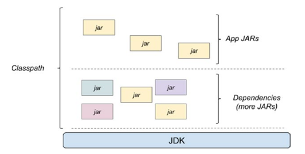

# :back: [README](../../../README.md#programming-languages)

<h1 align="center">
   Bibliotecas - Java
</h1>

Do inglês library, bibliotecas servem para agrupar um ou mais JARs.

Uma aplicação Java pode fazer uso de uma ou mais bibliotecas, e em ordem a ser executada, precisa de todas as suas dependências (`dependencies`) (All the JARs) no classpath. Dessa forma, para executar uma aplicação Java é necessário ter o JDK, as dependências (External JARs), e os JARs da própria aplicação.

 
 

