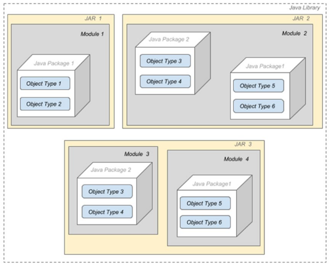

# :back: [README](../../../README.md#programming-languages)

<h1 align="center">
   Módulos - Java
</h1>

Módulos são utilizados para agrupar e encapsular pacotes.

Um módulo tem um nome exclusivo e é um grupo reutilizável de pacotes e recursos (Arquivos XML) descritos em um arquivo nomeado `module-info.java`. Este arquivo contêm os seguintes itens:
-  O nome do módulo
-  As dependências do módulo (ou seja, outros módulos a que este módulo é dependente)
-  Os pacotes que tornam explicitamente disponíveis outros módulos (Todos os outros pacotes no módulo são implicitamente indisponíveis para outros módulos)
-  O serviço oferecido
-  O serviço consumido
-  Para quais outros módulos permite espelhar
-  Código nativo
-  Recursos
-  Dados de configuração

Em teoria, a nomeação de módulos é semlhante a nomeação dos pacotes e seguem a convenção reversed-­
domain-­name.

Na prática, certifique-se que o nome do módulo não contenha números e descreve transparentemente o seu propósito.

O arquivo `module-info.java` é compilado num **descritor de módulo** (module descriptor) que gera o arquivo `module-info.class` e este é compactado junto a outras classes num arquivo JAR.



there is no need to create a directory for the module in JAR1 and JAR2.
For JAR3, there are two modules archived in the same JAR; in this case, we need to explicitly
separate their sources. The reason for this is the need to have two module-info.java files, and
obviously no operating system allows two files in the same directory to have the same name.

<br>

A plataforma java possui por volta de 95 módulos que podem ser visualizados através do comando `--list-modules`, este número pode veriar a depender da versão.

Faça no terminal:

```s
java --list-modules
```

> Cada módulo é seguido pelo seu número de versão `@10`, neste caso, o módulo pertence ao Java 10.

<br>

Sendo assim, se uma aplicação Java não precisa de todos os módulos para funcionar corretamente, então um runtime pode ser criado apenas com os módulos necessários. A ferramenta para construir este runtime personalizado chama-se `jlink`, que faz parte dos exetáveis do JDK. Isso perminite altos nível de **escalabilidade** e aumento de **performance**.

Sintaxe:

```java
module chapter.three {

}
```

<br>
<br>

# Configurando módulos
Dentro dos colchetes de um módulo, diferentes diretivas (directives) podem ser declaradas utilizando as seguintes palavras-chave:
-  requires 
-  exports 
-  module 
-  open 
-  opens... to
-  provides... with
-  transitive

<br>
<br>

# requires
Módulos podem depender uns dos outros. Por exemplo, o módulo `chapter.three` pode precisar ter acesso aos pacotes e classes no módulo `chapter-zero`, dessa forma faremos:

Exemplo:

```java
module chapter.three {
   requires chapter.zero;
}
```


<br>
<br>

# exports

<br>
<br>

# module

<br>
<br>

# open

<br>
<br>

# opens... to

<br>
<br>

# provides... with

<br>
<br>

# transitive

<br>
<br>


