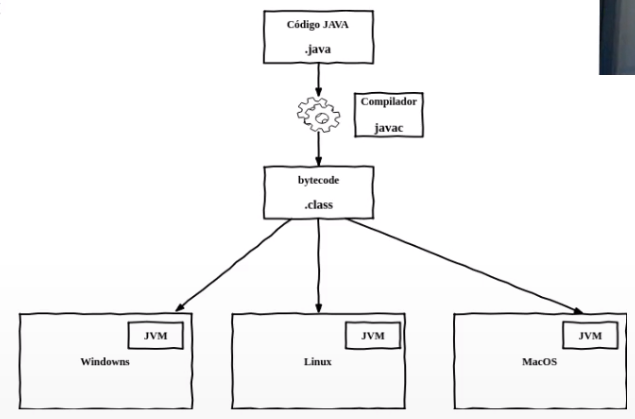
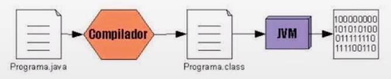
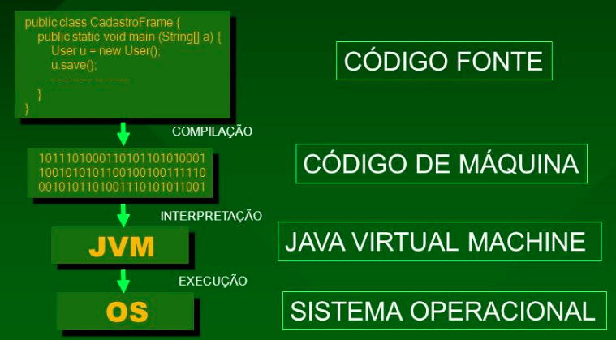
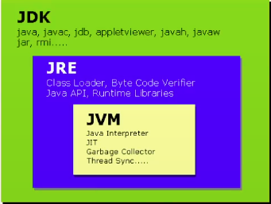
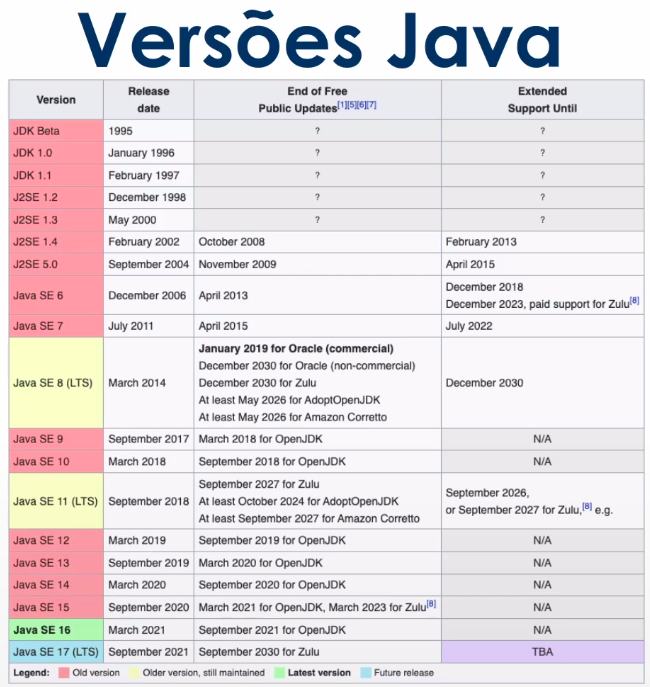

# :back: [README](../../../README.md#programming-languages)

<h1 align="center">
    Java
</h1> 

 

# Introdução
Diferentes de outras linguagens de programação, que são **compiladas** para **código nativo** ainda em tempo de desenvolvimento, a linguagem Java é comilada para um **bytecode** que é interpretado por uma **máquina virtual** (JVM).

 

## Compilador
Um compilador é um **programa** que, a partir de um **código fonte**, cria um programa semanticamente equivalente, porém escrito em outra linguagem, **código objeto**. Um compilador traduz um programa de uma linguagem textual para um linguagem de máquina, específica para um processador e sistema operacional.

O nome **compilador** é usado principalmente para os programas que **traduzem** o **código fonte** de uma `linguagem de programação de alto nível` para uma `linguagem de programação de baixo` nível (por exemplo, **Assembly** ou **código de máquina**).

 

## Bytecode
É o **código originado** da compilação de programas **Java**.

O **bytecode** é o programa interpretado e executado pela **máquina virtual Java** (JVM).

 

## JVM (Java Virtual Machine)
Primeiramente, uma **Virtual Machine** (VM), ou máquina virtual, é um software que simula uma máquina física e consegue executar vários programas, gerenciar processos, memória e arquivos. Tudo isso faz parte de uma plataforma com memória, processador e outros recursos totalmente virtuais, sem dependência do hardware. 

Já a JVM é a máquina virtual do Java, responsável por executar o bytecode (.class).

Em linguagens compiladas diretamente para um sistema operacional (SO) específico, esse programa não irá executar em outro SO, havendo a necessidade de compilar uma versão do software para cada SO.

Com o Java, compilamos para a JVM, o bytecode será executado pela máquina virtual, e não diretamente pelo SO, assim, o software escrito em java possui portabilidade para qualquer sistema operacional, porém, cada JVM deve ser construída para um SO específico.

 

## Fases de execução de um programa Java

1. Escrevemos o seu código-fonte (arquivo com extensão .java)
2. Utilizamos o JDK (Java Development Kit) para compilar os seu código-fonte e gerar o arquivo bytecode (arquivo com extensão .class)
3. Para executar o seu programa, a JVM (Java Virtual Machine) lê o arquivo compilado (.class) e as bibliotecas padrões do Java que estão no JRE (Java Runtime Environment).

 

## Ciclo de vida de uma aplicação Java

 

## JDK (Java Development Kit)
É o kit de desenvolvimento Java responsável por compilar o código-fonte (.java) em um bite code (.class).

**Obs.:** O JDK é um conjunto de ferramentas para desenvolver programas baseados em Java e este ambiente é voltado para os desenvolvedores. Ou seja, a JDK faz parte do funcionamento das IDE's que auxiliam no desenvolvimento em Java, por exemplo o IntelliJ, Eclipse, NetBeans, VSCode entre outros.

 

## JRE (Java Runtime Environment)
É o ambiente de execução do Java que fornace as bibliotecas padrões do Java para o JDK compilar o seu código e para a JVM executar o seu programa.

 

## Visão geral

 
 

# Plataforma Java
A pltaforma Java é dividida em:
-   Java SE (Java Plataform, Standard Edition);
-   Java EE (Java Plataform, Enterprise Edition);
-   Java ME (Java Plataform, Micro Edition);
-   Java Card;
-   Java FX;

 

## Plataforma x Linguagem
A linguagem de programação Java é a linguagem convencional da Plataforma Java, mas não é sua única linguagem (Groovy, Jython, JRuby).

Uma grande vantagem da plataforma é a de não estar presa a um único sistema operacional ou hardware, pois seus programas rodam através de uma máquina virtual que por der emulada. Por isso precisamos do JRE para rodar um programa Java, pois o JRE possui todos os componentes, incluindo a JVM, para que possamos conseguir emular um programa em Java.

 

## Java SE
É a base da plataforma Java e trás consigo algumas classes comuns à todas as outras plataformas.

 

## Java EE
É, provavelmente, a mais conhecida e cuida da parte do desenvolvimento web.

 

## Java ME
Cuida da parte do desenvolvimento de dispositivos móveis e embarcados.

 
 

# Versões Java
Existem várias mas as duas principais são:
-   OpenJDK
    -   É open source (GNU - General Public License).
    -   Tem suporte de longo prazo (LTS) e, normalmente, uma versão nova é lançada a cada quatro anos.
        -   A cada lançamento de LTS é que algumas funcionalidades são adicionadas ou retiradas.
        -   As versões intermédiárias, entre uma LTS e outra LTS, são chamadas de Beta.
        -   As empresas, lógicamente, utilizam as versões LTS.
        -   
-   JDK Oracle
    -   Requer licensa comercial sob contrato de Licença de Código Binário Oracle.

 
 

# IDE's Java

## Eclipse
É uma IDE para desenvolvimento Java, porém suporta várias outras linguagens. Ele foi feito em Java e segue o modelo open source de desenvolvimento de software.

 

## IntelliJ IDEA
É uma IDE escrita em Java para o desenvolvimento de software de computador. Está disponível como uma edição da comunidade licenciada Apache 2 e em uma edição comercial proprietária.