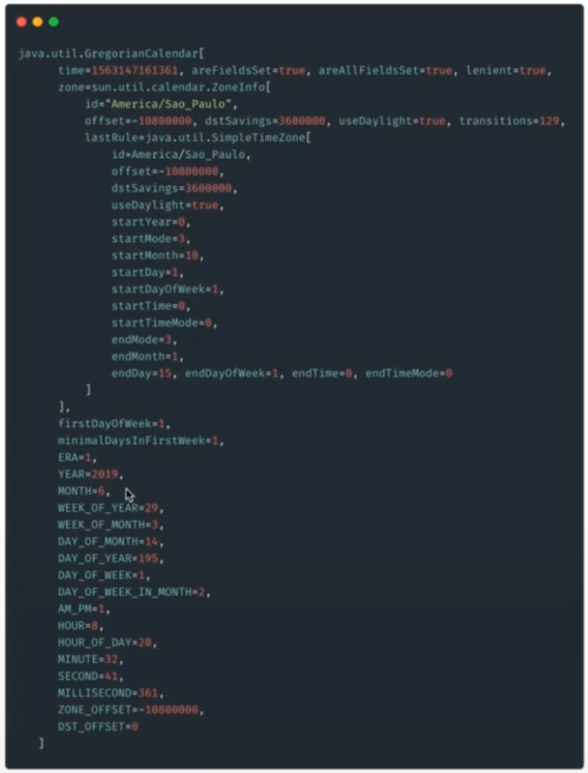
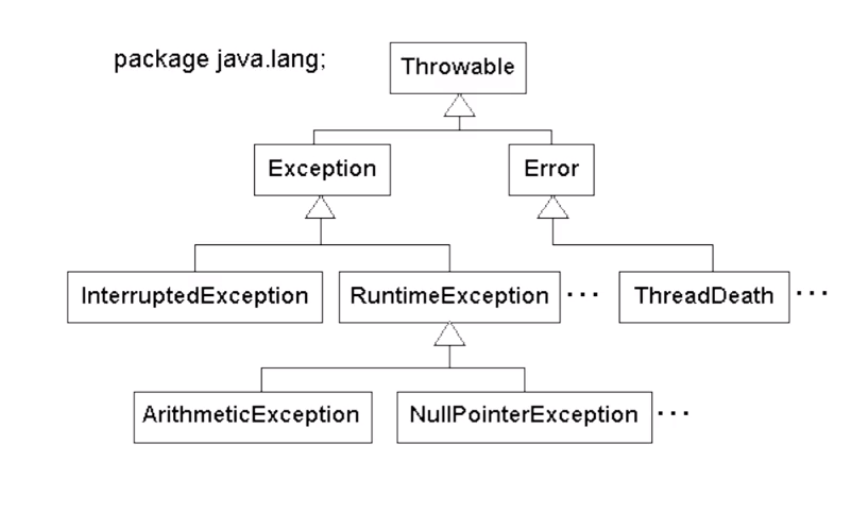

# :back: [README](../../../README.md#programming-languages)

<h1 align="center">
    Características de um programa Java
</h1> 

<br>

# Geral
Um programa simples em java terá algumas características básicas, observe abaixo:

```java
package com.rodrigofentanes.nomeDaPasta;

public class NomeDaClasse {
    public static void main(String[] args) {
        System.out.println("Hello world!");
    }
}
```

<br>
<br>

# Packages
São as pastas dentro da estrutura de nosso projeto. Abaixo indicamos que estamos na pasta `com.rodrigofentanes` e dentro dela temos a pasta `nomeDaPasta`:

```java
package com.rodrigofentanes.nomeDaPasta;
```

<br>
<br>

# Classes
A palavra reservada **class** é utilizada para definir uma classe java.

Por convenção **toda** classe java começa com letra **maiúscula**.

Todo programa Java roda em cima de uma classe: 

```java
public class NomeDaClasse
```

Note a palavra **public**, ela é uma **palavra reservada** utilizada para definir um **modificador de acesso**. 

<br>

## Construtores
Um construtor é um método "especial" que leva o mesmo nome da classe em que está inserido e especifica como iremos "construir" esta classe quando formos instaciá-la.

<br>

## Instanciação
**Instanciar** uma classe nada mais é que pegar o molde da classe e subir para a memória do computador, dando vida a classe. Ao instarciarmos uma classe, ela passa a ser chamada de **objeto**.

## Objeto
Um objeto é a classe em vida, ou seja, uma classe alocada na memória do computador durante a execução do programa.

<br>
<br>

# Modificadores de acesso
Os modificadores de acesso em Java são:
-   private
-   default
-   protected
-   public
-   abstract
-   static
-   final

## private
Este é o modificador de acesso mais restritivo, pois um elemento definido com esse modificador só pode ser acessado de dentro da própria classe onde o mesmo foi definido.

Só é possível atribuir private a atributos e métodos. Classes não podem ser caracterizadas como private.

<br>

## default
Quando não explicitamos o uso de nenhum modificador, o modificador Default é aplicado e, o elemento definido com esse modificador, pode ser acessado não só dentro da própria classe, mas também a partir de qualquer outra classe que esteja dentro do mesmo pacote (package).

<br>

## protected
Este modificador já permite um grau maior de acesso, uma vez que o elemento definido com esse modificador possui as mesmas características do modificador Default e também pode ser acessado a partir de uma classe que não esteja no mesmo pacote, desde que a classe a partir da qual será feito o acesso, seja uma classe filha (relação de herança).

Torna o membro acessível às classes do mesmo pacote ou através de herança, mas seus membros herados não são acessíveis a outras classes fora do pacote em que foram declarados.

<br>

## public
Este é o modificador de acesso mais abrangente, uma vez que o elemento definido com esse modificador pode ser acessado a partir de qualquer classe da aplicação, estando ou não dentro do mesmo pacote.

<br>

## abstract
Esse modificador não é aplicado às variáveis, apenas às classes e métodos. 

Uma classe abstrata **não pode ser instanciada**. 

Se houver alguma declaração de um método como abstract (abstrato), a seu classe também deverá ser marcada como abstract.

É uma opção interessante para a construção de APIs por exemplo.

<br>

## static
É usado para a criação de uma variável que poderá ser acessada por todas as instâncias de objetos desta classe como uma variável comum, ou seja, a variável criada será a mesma em todas as instâncias e quando seu conteúdo é modificado numa das instâncias, a modificação ocorre em todas as demais. E nas declarações de métodos ajudam no acesso direto à classe, portanto não é necessário instânciar um objeto para acessar o método.

Ou seja, isso quer dizer que todas as instâncias de um objeto terão a mesma característica, de forma compartilhada.

<br>

## final
Quando é aplicado em Classe, não permite estender. 
Quando é aplicado em métodos, impede que o mesmo seja sobrescrito na subclasse. 
Quando é aplicado a uma variável, esta não poderá ter o valor alterado depois de deste ser atribuído. 

<br>

## Tabela de referẽncia
| modificador de acesso | dentro da classe | dentro do pacote | fora do pacote (subclasse) | fora do pacote |
| :-: | :-: | :-: | :-: | :-: |
| Private | Sim | Não | Não | Não |
| Default | Sim | Sim | Não | Não |
| Protected | Sim | Sim | Sim | Não |
| Public | Sim | Sim | Sim | Sim |

<br>
<br>

# Tipos
Os quatro grupos de tipos java, são eles:
-   Primitivos;
-   Wrappers;
-   Não primitivos;
-   Tipagem forte e estática;

## Primitivos
Um tipo primitivo **nunca** poderá ter valor igual a `nulo`.
Por não poderem ser nulos, os tipo primitivos tem valores default atribuídos à eles caso não sejam associados a um valor. 

É importante saber que uma variável do tipo primitivo, que não tem um valor atribuído a ela, não pode ser chamada, porém uma vez instanciadas essas variáveis "não iniciadas" terão os valores default associados às mesmas.

Veja abaixo os tipo primitivos em Java e seus valores default:

| Data type | Default Value | Lenght (bits) | Limits and Exemples |
| :-: | :-: | :-: | :-: |
| byte | 0 | 8 | -128 BETWEEN 127 |
| short | 0 | 16 | -32768 BETWEEN 32767 |
| int | 0 | 32 | -2147483648 BETWEEN 2147483647 |
| long | 0L | 64 | -9223372036854775808L BETWEEN 9223372036854775807L |
| float | 0.0f | 32 | 65f ; 65.5f |
| double | 0.0d | 64 | 1024.99 ; 10.2456 |
| char | 'u0000' | 16 | 'A' ; 15 |
| String (or any object) | null |  | É uma classe e representa uma sequência de caractéres |
| boolean | false |  | true ; false |


<br>

## Wrappers
São objetos (classes) que representam os tipos primitivos do Java. Partilham de muitas características dos objetos primitivos mas têm algumas diferênças.

Podem receber valor `nulo`.

<br>

### Auto-boxing (Wrappers)
| Auto-boxing| Default Value | Lenght (bits) | Limits and Exemples |
| :-: | :-: | :-: | :-: |
| Byte | 0 | 8 | -128 BETWEEN 127 |
| Short | 0 | 16 | -32768 BETWEEN 32767 |
| Integer | 0 | 32 | -2147483648 BETWEEN 2147483647 |
| Long | 0L | 64 | -9223372036854775808L BETWEEN 9223372036854775807L |
| Float | 0.0f | 32 | 65f ; 65.5f |
| Double | 0.0d | 64 | 1024.99 ; 10.2456 |
| Character | 'u0000' | 16 | 'A' ; 15 |
| Boolean | false |  | true ; false |

<br>

### Unboxing (Wrappers)
Acontece quando construímos um objeto e atribuimos este a um tipo primitivo de mesmo tipo.

```java
int i = new Integer(3);

int inteiro = Integer.valueOf(1024);

boolean b1 = Boolean.TRUE;

boolean b2 = Boolean.getBoolean("false");

```

<br>

## Não primitivos
São eles:
-   String
-   Number
-   Object
    -   É o objeto principal do java, todos os objetos "extendem" deste objeto.
-   QualquerOutroObjeto

A grande vantagem de usar estes objetos herdam as muitas propriedades de `object`. 

<br>

## Tipagem forte
Significa que uma vez atribuído um tipo a uma variável, não conseguimos mudá-lo.

<br>

## Tipagem estática
Significa que em Java os tipos são verificados em tempo de compilação, diferentemente de uma linguagem de tipagem dinâmica em que a tipagem é verificada em tempo de execução. Isso quer dizer que logo ao compilar o código Java, você já obterá um erro caso atribua um valor incompatível com uma variável.

<br>

## Inferência de tipo
É a capacidade de criar uma variável sem informar o tipo da mesma.

```java
var numero = 1;
```

É importante ressaltar que mesmo tendo esta possibilidade, a linguagem Java ainda possui tipagem forte, o que significa que uma vez este tipo inferido à variável, não será possível alterá-lo posteriormente.

<br>

## Casting
Ocorre ao "promovermos" uma variável de um tipo para outro tipo.

<br>
<br>

# Métodos
Existe uma diferênça conceitual entre funções e métodos, apesar de organicamente terem o mesmo comportamento.

Superficialmente, podemos dizer que uma função é a "função" que existe fora e independentemente de uma classe. Já um método, é uma "função" que é propriedade de uma classe.

Como em Java tudo funciona através de classes então sempre chamaremos suas funções de métodos.

## main
Abaixo veremos o principal método java, o `main`:

```java
public static void main(String[] args) {
    System.out.println("Hello world!");
}
```

Este método é o centro de um programa Java. O método `main` sempre receberá o parâmetro/atributo/argumento `args`, que é uma variável vetor do tipo String (`String []`). E, normalmente, aponta para uma posição da memória.

A palavra reservada `void` é utilizada para indicar que um método não ira retornar um valor, ou seja, ira retornar "vazio".

<br>
<br>

# Interfaces
Interfaces são como contratos entre as implementações.
Uma interface por extender de outra interface.
Uma interface porde ter:
-   Métodos abstratos
    -   Devem ser implementados por todos
    -   Se adicionarmos um método novo à interface, quebramos o "contrato" firmado, ou seja, quebramos as implementações;
-   Métodos default
    -   São métodos concretos que tem comportamentos herdados a todos que implementam;
    -   Novos métodos não quebram as implementações;
-   Herança multipla ***
    - O java não possue herança mútipla, ou seja, não podemos extender mais de uma classe, mas com as interfaces conseguimos implementar mais de uma interface.

Abaixo um exemplo de interface em Java:

```java
package com.rodrigofentanes.interfaces;

public interface Carro {
    String marca();

    default void ligar(){
        System.out.println("Ligando o carro!");
    }
}

public interface Veiculo {
    String registro();
}
```

Abaixo vemos a interface sendo utilizada:

```java
package com.rodrigofentanes.interfaces;

public class Gol implements Carro {
    
    @Override
    public String marca(){
        return "Volkswagen";
    }

    Carro.super.ligar(); //Este é um tipo de método que só pode ser acessado por quem implementa Carro.
}
```

Quando uma classe **implementa** "algo" ela se torna este "algo".

Veja abaixo um exemplo de "herança multipla" em Java:

```java
package com.rodrigofentanes.interfaces;

public class Gol implements Carro, Veiculo {
    
    @Override
    public String marca(){
        return "Volkswagen";
    }

    @Override
    public String registro(){
        return "54AS87AD";
    }
}
```

<br>
<br>

# Enums
Enumerações são, basicamente, dicionários de dados imutável.

Não é possível criar algo numa extrutura enum, ou seja, não é permitido criar novas instâncias.

O construtor de um enum sempre é declarado como private.

Por convenção, por serem objetos constantes e imutáveis (static final), os nome são em MAIÚSCULOS.

Exemplos:

```java
package com.rodrigofentanes.enums;

public enum TipoVeiculo {
    TERRESTRE,
    AQUATICO,
    AEREO;
}

public enum Status {
    OPEN(13, "Abertp"),
    CLOSE(02, "Fechado");

    private ind cod;
    private String texto;

    Status(final ind cod, final String texto){
        this.cod = cod;
        this.texto = texto;
    }

    public int getCod(){
        return cod;
    }
    public String getTexto(){
        return texto;
    }
}
```
Utilizando um enum:

```java
package com.rodrigofentanes;

public class Programa {
    public static void main(String[] args) {
        System.out.println(TipoVeiculo.TERRESTRE);

        System.out.println("Texo do status: ${Status.OPEN.getTexto()}");
    }
}
```

<br>
<br>

# String
Como já visto anteriormente, String é uma classe que representa uma sequência de caractéres. Ela vem dentro do pacote **java.lang**.

Exesitem diversas formas de utilizar uma string, veja:

```java
package com.rodrigofentanes.classes;

public class Programa {
    public static void main(String[] args) {
        var nome = "Rodrigo";
        var sobrenome = "Fentanes";
        final var nomeCompleto = nome + sobrenome;

        System.out.println(nome);
        System.out.println("Nome: " + nome);
        System.out.println("Nome completo: " + nomeCompleto);
        System.out.println("Nome completo: " + nomeCompleto);

        var nomeDaVariavel = new String("Minha string"); // isso é redundante
        
        // Como visto anteriormente, todos os tipos "Não primitivos" herdam métodos e outras características que podem nos ajudar ao construir nossas soluções. Vemos abaixo alguns métodos próprios do tipo String: 

        System.out.println("Char na posição: " + nodaDaVariavel.charAt(5));

        System.out.println("Quantidade de caracteres: " + nodaDaVariavel.lenght());

        // Existem outros métodos próprios da classe que caracteriza o tipo String que são muito úteis.

        // É possível colocar o texto formatado de forma mais legível para quem está codificando, dessa forma temos
        final var mensgem = String.format("Número: %.2f", 1.2345d); // Formata um número e retorna apenas duas casas após o ponto flutuante.

        // StringBuilder
        var texto = "Um text";
        final var builder = new StringBuilder(texto);
        System.out.println(builder.append("o continuação do texto!")); // printa "Um texto continuação do texto!"

        final var reverse = builder.reverse();
        System.out.println(reverse); // printa o texto "!otxet od oãçaunitnoc otxet mU"

        final var insert = reverse.insert(0, "#").insert(reverse.lenght(), "#");
        System.out.println(insert); // printa o texto "#!otxet od oãçaunitnoc otxet mU#"

    }
}
```
## Cheat Sheet (Tipos não primitivos)

| Classe | método | Exemplo | Descrição |
| :-: | :-: | :-: | :-: |
| String | charAt | variavel.charAt(5); | Retorna o caractere na posição 5 |
| String | lenght | variavel.lenght(); | Retorna o tamanho da string |
| String | trim | variavel.trim(); | Retorna retira os espaços extras em branco |
| String | toLowerCase | variavel.toLowerCase(); | Retorna a string com todos os caracteres minúsculos |
| String | toUpperCase | variavel.toUpperCase(); | Retorna a string com todos os caracteres Maiúsculos |
| String | contains | variavel.contains("N"); | Verifica se a string contém determinado caractere e retrona `true` ou `false` |
| String | replace | variavel.replace("n", "!"); | Troca determinado caractere por outro, Neste caso onde tem "n" terá "exclamação" |
| String | equals | variavel.equals("Um texto"); | Verifica se o a string do equals a mesma da variável e retorna `true` ou `false`. É case sensitive. |
| String | equalsIgnoreCase | variavel.equalsIgnoreCase("Um texto"); | Verifica se o a string do equals a mesma da variável e retorna `true` ou `false`. Não é case sensitive. |
| String | substring | variavel.substring(1, 6); | Retorna apernas o valor dentro da posição especificada. |
| String | format | variavel.format("O cliente possui o nome s% e o sobrenome %s", nome, sobrenome); | Mais exemplos em: https://dzone.com/articles/java-string-format-examples <br><br> https://www.javatpoint.com/java-string-format |
| String | toCharArray | variavel.toCharArray(); |  |
| String | split | variavel.split(); |  |
| String | concat | variavel.concat(); |  |
| String | replaceAll | variavel.replaceAll(); | Nos possibilita trabalhar com regex |

<br>
<br>

# Laços, condicionais e operadores lógicos

## Operadores

| Operador | Tipo | Exemplo | Descrição |
| :-: | :-: | :-: | :-: |
| = |  | `x = b` | Atribui o valor de 'b' à 'x' |
| == |  | `x == b` | verifica se 'x' é igual a 'b' |
| != |  | `x != b` | verifica se 'x' é diferente de 'b' |
| ! |  | `!b`  | nega o valor de 'b' |
| + |  | `a + b` | soma |
| - |  | `a - b`  | subtração |
| * |  | `a * b`  | multiplicação |
| / |  | `a / b`  | divisão, divide a por b |
| % |  | `a % b`  | módulo, retorna o resto da divisão |
| *= |  | `x *= 2`  | é o mesmo que escrever `x = x * 2` |
| > |  | a > b | maior que |
| < |  | a < b | menor que |
| >= |  | a >= b | maior ou igual |
| <= |  | a <= b | menor ou igual |
| && | Sort circuit | a == b && a < x | É o operador lógico "E", pode ser utilizado também como uma forma mais performática de fazer ifs encadeados. No caso do exemplo, "a" é igual a "b" E "a" é menor que "x". É importante ressalta que se uma condição anterior a outra for verdadeira, ele não continuará verificando as próximas e entrará na nossa estrutura. |
| \|\| | Sort circuit | a == b \|\| a < x | Tanto faz se é um ou outro. Se "a" é igual a "b" OU "a" é menor que "x". É importante ressalta que se uma condição anterior a outra for verdadeira, ele não continuará verificando as próximas e entrará na nossa estrutura. |
| \| | Non sort circuit | a == b \| a < x | Ele vai verificar todas condições mesmo que a primeira for verdadeira. |  
| ++ | incremento | a++ | "a" mais 1 |  
| ++ | decremento | a-- | "a" menos ' |  

<br>

## if
```java
package com.rodrigofentanes;

public class Programa {
    public static void main(String[] args) {
        var condicao = true;

        if (condicao){
            // faça isso pois a condição a verdadeira
        }else{
            // faça isso pois a condição é falsa
        }

        if (condicao){
            // se condicao verdadeira
        } else if (condicao == false) {
            // se outra condicao verdadeira
        } else if (condicao == 10) {
            // se outra condicao verdadeira
        } else {
            // se nenhuma das condições acima for verdadeira
        }
    }
}
```

<br>

## Ternário
```java
package com.rodrigofentanes;

public class Programa {
    public static void main(String[] args) {
        final var condicao = false;
        final var ternario = condicao ? "é verdadeira" : "é falsa";
        System.out.println(ternario); // vai imprimir "é falsa"
        
    }
}
```

<br>

## for
O `for` é uma estrutura de três partes:
-   A condição inicial
-   A condição que será verificada em TODAS, inclusive no início, de todas as repetições/interações de um `for` e , sendo a condição verdadeira, entramos na nossa estrutura de laço.
-   A ação de será executada ao final de cada interação.

```java
package com.rodrigofentanes;

public class Programa {
    public static void main(String[] args) {
        for(int i = 0; i <= 10; i = i++){
            //faz isso
        }
    }
}
```

<br>

## while
Enquanto algo for verdadeiro, faça. Primeiro testa depois faz.

```java
package com.rodrigofentanes;

public class Programa {
    public static void main(String[] args) {
        var i = 0;
        while(i <= 10){
            i++;
        }
    }
}
```

<br>

## do while
Faça, enquanto isso for verdade. Primeiro faz depois testa.

```java
package com.rodrigofentanes;

public class Programa {
    public static void main(String[] args) {
        var i = 0;
        do{
            i++;
        }while(i <= 10);
    }
}
```

<br>

## forEach
"Para cada" faça.

```java
package com.rodrigofentanes;

public class Programa {
    public static void main(String[] args) {
        IntStream.of(1,2,3,4,5).forEach( n -> {
            // faça isso
        });

        IntStream.range(0,3).forEach( n -> {
            // faça isso
        });
    }
}
```

<br>
<br>

# Convenções de nomes

## Nomes de métodos
Segue o padrão `nomeDoMetodo`.

<br>

## Nomes de classes
Classes seguem o padrão "CamelCase" (`NomeDaClasse`).

<br>

## Nomes de variáveis
Nomes de variáveis devem ser descritivos e sucintos e deve seguir o padrão `nomeDaVariavel`. 

É fortemente contra indicado a utilização de variáveis como `letraA` ou `nome1` ou `x`.

É contra indicado incluir caractéres especiais nos nomes de variável, exemplo: `nome_da_variavel` ou `variável` ou `variavel$`.

Não devemos fazer: `variável`

<br>

## Ferramentas de verificação/padronização
É FORTEMENTE INDICADA A UTILIZAÇÃO DESSAS FERRAMENTAS. É importante ressaltar que elas não só indicam erros e inconsistências, pois em sua documentação elas também costumam explicar o porquê, sendo assim, por consequência, ferramentas que estimulam a formação de um bom programador.

Exemplos:
-   Checkstyle Gradle Plugin;
-   PMD Gradle Plugin;

Para incluí-los num projeto basta inserir, no caso do gradle, no arquivo "build.gradle" como no código abaixo:

```java
plugins {
    id 'java'
    id 'checkstyle'
    id 'pmd'
}

// Neste mesmo arquivo, configurar também será necessário:

ckeckstyle {
    // configuração
}

pmd {
    // configuração
}
```

É válido lembrar que muitas dessas ferramentas já estão disponíveis no build de ferramentas do gradle por exemplo.

Também é necessário

<br>
<br>

# Debug
É a prática de análisar, da melhor forma, linha a linha dos códigos de um programa.

## Break point
A maioria das IDEs tem esta funcionalidade. No início de cada linha, é possível adicionar um "ponto" vermelho no código. Esses pontos significam que queremos parar de executar o código naquela linha, para observar algo, e depois continuar (rerun).

Também é possível ir avançando e voltando linhas a partir de um break point, entrar em funções, mudar nomes de variáveis, etc. E isso tudo é feito em tempo de execução.

Normalmente, precisamos rodar um "debug" ao invés de "run" quando queremos utilizar dessa funcionalidade.

<br>
<br>

# Tratamento de dados

## Dados do tipo Data

| Classe | Método | Exemplo | Descrição |
| :-: | :-: | :-: | :-: |
| java.util.Date | after | after(Date) | Retorna um `boolean`. Checa se o objeto Data de referência é posterior ao comparado |
| java.util.Date | before | before(Date) | Retorna um `boolean`. Checa se o objeto Data de referência é anterior ao comparado |
| java.util.Date | compareTo | compareTo(Date) | Retorna um `int`. Compara dois objetos Data |
| java.util.Date | equals | equals(Date) | Retorna um `boolean`. Checa se os objetos são iguais |
| java.util.Date | getTime | getTime() | Retorna um `long`. Retorna a data em milissegundos |
| java.util.Date | setTime | setTime(long) | Retorna `void`. Define uma data com base em milissegundos |
| java.util.Date | from | from(Instant) | Retorna `static Date`. Define uma data com base em um **Instant** |
| java.util.Date | toInstant | toInstant() | Retorna `Instant`. Retorna um Instant com base em um Date. <br><br> A classe **instant** é imutável e Thread Safe, ela modela um ponto instantâneo de uma linha do tempo. É indicado para gravar marcações temporais em eventos da sua aplicação. |

O `java.util.Date` é a classe responsável por lidar com datas e é também uma das classes mais antigas da linguagem.

Contrutoras da classe `java.util.Date`:

```java
/* construtores depreciados */

Date(int year, int month, int date)

Date(int year, int month, int date, ins hrs, int min)

Date(int year, int month, int date, ins hrs, int min, int sec)

Date(String s)

/* construtores recomendados */

Date() // Este construtor vai alocar um objeto da classe Date e o iniciará com o milissegundo mais próximo do período da sua execução.

Date(long date) // Diferente do construtor anterior, este construtor espera que você passe os milissegundos com base padrão de tempo (epoch) que usa como referência '1 de janeiro de 1970 00:00:00'

// O timestamp epoch é um padrão largamente aceito para representar uma data como um inteiro 32-bits a partir do início do Unix Epoch, isso nos ofere compatibilidade entre libguagens

System.currentTimeMillis() // Este método estático vai nos retornar o milissegundo mais próximo de sua execução com base no sistema operacional

```

```java
import java.util.Date;

public class Exemplo {
    public static void main (String[] args){
        // Date()
        Date novaData = new Date();
        System.out.println(novaData); 
        // Thu Jul 08 09:55:08 BRT 2021

        // Date(long date)
        Long currentTimeMillis = System.currentTimeMillis();
        System.out.println(currentTimeMillis); 
        // 1563127311564
        Date outraData = new Date(currentTimeMillis);
        System.out.println(outraData); 
        // Sun Jul 14 15:01:51 BRT 2019
    }
}
```

<br>

### after & before
```java
import java.util.Date;

public class Exemplo {
    public static void main (String[] args){
        Date dataNoPassado = new Date(1563127311564L);
        Date dataNoFuturo = new Date(1613127311564L);
        Date mesmaDataNoFuturo = new Date(1613127311564L);

        boolean isEquals = dataNoFuturo.equals(mesmaDataNoFuturo); //true
        boolean isEquals = dataNoFuturo.equals(dataNoPassado); //false
        
        boolean compareToCase1 = dataNoPassado.compareTo(dataNoFuturo); // -1
        boolean compareToCase2 = dataNoFuturo.compareTo(dataNoPassado); // 1
        boolean compareToCase3 = dataNoFuturo.compareTo(mesmaDataNoFuturo); // 0
    }
}
```

<br>

### compareTo & equals
```java
import java.util.Date;

public class Exemplo {
    public static void main (String[] args){
        Date dataNoPassado = new Date(1563127311564L);
        Date dataNoFuturo = new Date(1613127311564L);

        boolean isAfter = dataNoPassado.after(dataNoFuturo); //false
        boolean isBefore = dataNoPassado.before(dataNoFuturo); // true
    }
}
```

<br>

### toInstant (Classe Instant)
```java
import java.util.Date;

public class Exemplo {
    public static void main (String[] args){
        Date dataInicio = new Date(1563127311564L); 
        // Tue Dec 22:26:47 BRST 2017

        Instant instante = dataInicio.toInstant(); 
        // 2017-12-13T00:26:47.691Z
    }
}
```

<br>

## java.util.calendar
Existe para facilitar alguns recursos que a classe `Date` oferecia e foram depreciados exatamente pelo fato da `calendar` chegar com facilidades.

Calendar é uma classe abstrata que provê métodos para converter data entre um instante específico.

O calendar possui alguns campos específicos para manipulação como MONTH, YEAR, HOUR, etc.

<br>

### Classe calendar


<br>

### Capturando o instante com calendar
```java
import java.util.Calendar;

public class Exemplo {
    public static void main (String[] args){
        Calendar agora = Calendar.getInstance(); // 
    }
}
```

<br>

### Manipulando datas
```java
import java.util.Calendar;

public class Exemplo {
    public static void main (String[] args){
        Calendar agora = Calendar.getInstance();
        System.out.println("A data corrente é: " + agora.getTime); 
        // Sun Jul 14 20:50:31 BRT 2019

        agora.add(Calendar.DATE, -15);
        System.out.println("15 dias atrás: " + agora.getTime); 
        // Sat Jun 29 20:50:31 BRT 2019
        
        agora.add(Calendar.MONTH, 4);
        System.out.println(a"4 meses depois: " + gora.getTime); 
        // Teu OCT 29 20:50:31 BRT 2019
        
        agora.add(Calendar.YEAR, 2);
        System.out.println("2 anos depois: " + agora.getTime); 
        // Fri Oct 29 20:50:31 BRT 2021
    }
}
```

<br>

### Imprimindo da e horas (Alguns exemplos)
```java
import java.util.Calendar;

public class Exemplo {
    public static void main (String[] args){
        Calendar agora = Calendar.getInstance();
        System.out.println("%tc\n" + agora); 
        // Dom Jul 14 20:58:11 brt 2019
        
        System.out.println("%tF\n" + agora); 
        // 2019-07-14
        
        System.out.println("%tD\n" + agora); 
        // 07/14/19
        
        System.out.println("%tr\n" + agora); 
        // 08:58:11 pm
        
        System.out.println("%tT\n" + agora); 
        // 20:58:11
    }
}
```

<br>

## java.text.DateFormat & java.text.SimpleDateFormat
Oferece maneiras de formatar e parsear a saída das datas.

```java
import java.text.DateFormat;
import java.util.Date;

public class Exemplo {
    public static void main (String[] args){
        Date agora = new Date();

        String dateToStr = DateFormat.getInstance().format(agora)

        System.out.println(dateToStr);
        // 14/07/2019 22:40

        dateToStr = DateFormat.getDateTimeInstance(DateFormat.LONG, DateFormat.SHORT).format(agora);

        System.out.println(dateToStr);
        // 14 de Julho de 2019 22:40

        dateToStr = DateFormat.getDateTimeInstance(DateFormat.LONG, DateFormat.LONG).format(agora);

        System.out.println(dateToStr);
        // 15 de Julho de 2019 22h13min55s BRT
    }
}
```

O SimpleDateFormat trás uma grande facilidade que é definir um padrão de formatação para a saída de data que você deseja, veja:

```java
import java.text.SimpleDateFormat;
import java.util.Date;

public class Exemplo {
    public static void main (String[] args){
        Date agora = new Date();

        SimpleDateFormat formatter = new SimpleDateFormat("dd/MM/yyyy");

        String dataFormatada = formatter.format(agora);

        System.out.println(dataFormatada);
        // 14/07/2019
    }
}
```

<br>

## java.time
É a forma atual de trabalhar com datas. 

<br>

### java.time.LocalDate
É uma classe imutável para representar uma data. Seu formato padrão é `yyyy-MM-dd`

```java
import java.time.LocalDate;

public class Exemplo {
    public static void main (String[] args){
        LocalDate hoje = LocalDate.now();
        System.out.println(hoje);
        // 2019-07-14
        
        LocalDate ontem = hoje.minusDays(1);
        System.out.println(ontem);
        // 2019-07-13
    }
}
```

<br>

### java.time.LocalTime
É uma classe imutável para representar um padrão de hora-minuto-segundo. 

Pode representar até o nível de nanosegundos `12:22:10:123212345`

```java
import java.time.LocalDate;

public class Exemplo {
    public static void main (String[] args){
        LocalDate agora = LocalTime.now();
        System.out.println(agora);
        // 23:53:58:421

        LocalTime maisUmaHora = agora.plusHours(1);
        System.out.println(maisUmaHora);
        // 00:55:37:421
    }
}
```

<br>

### java.time.LocalDateTime
É uma classe imutável e utilizamos para trabalhar com horas e dias.

É possível manipular hora e data com precisão da nanosegundos `2nd October 2007 at 12:22:10:123212345`

```java
import java.time.LocalDateTime;

public class Exemplo {
    public static void main (String[] args){
        LocalDateTime agora = LocalDateTime.now();
        System.out.println(agora);
        // 2019-07-15T00:02:16:076

        LocalDateTime futuro = agora.plusHours(1).plusDays(2).plusSeconds(12);
        System.out.println(futuro);
        // 2019-07-17T01:02:28.076
    }
}
```

<br>
<br>

# Tratamento de excessões
Excessões são **todos** os erros que ocorrem durante o processamento de um método, estes erros podem ser **esperados** ou **não esperados**.

Como o termo já diz, "Exceptions" são excessões. Falhas que não devem ocorrer rotineiramente no **fluxo de um sistema**.

O ideal é criar excessões em cada método que é criado, pois erros podem ser esperados ou não, e o tratamento de erros deve ocorrer em **camadas** seguindo boas práticas de **design patterns**

O sistema de excessões é um encadeado de Classes e lembre-se, para cada erro disparado (exibido em tela) em um sistema construído em java, há uma exception para tratá-lo. 



<br>

## Checked Exceptions
São excessões esperadas, cujo fluxo ou método de um sistema foi preparado para receber. Um bom exemplo é uma excessão de negócio, onde se deseja informar um erro caso a excessão esperada ocorra.

<br>

## Unchecked Exceptions
São execessões não esperadas para o fluxo ou método de um sistema, um bom exemplo é a famosa NullPointExeception que ocorre quando se tenta acessar uma referência de memória vazia, ou recuperar uma instância que não existe, dentre outros motivos.

<br>

## Bloco "try" "catch"
O bloco try catch sempre é utilizado quando no processo que será executado dentro de um método é esperado um erro, então cria-se um bloco "protegido" onde qualquer erro que ocorra dentro do trecho "try" seja direcionado para o trecho "catch" e sofrerá o devido tratamento de erro.

É possível colocar vários catch dentro de um try.

Exemplo:
```java
public class Exemplo {
    public static void main (String[] args){
        public static void metodo(){
            try{
                new java.io.FileInputStream("arquivo.txt");
            } catch (java.io.FileNotFoundException e){
                System.println("Não foi possível abrir o arquivo para leitura");
            } catch (Exception e){
                // ação
            }
        }
        // O método acima tenta criar um arquivo e se, por qualquer motivo, ocorrer um erro, então o sistema enviará a mensagem de erro descrita acima.
    }
}
```

<br>

## Finally
É um bloco opcional que pode ser utilizado junto com o try catch, este trecho de código sempre será executado independente se ocorrer erro ou não dentro do fluxo onde existe o try catch. Normalmente o finally é usado para liberar recursos ou para dar continuidade em um fluxo que deve ocorrer independente de erro.

Exemplo:
```java
public class Exemplo {
    public static void main (String[] args){
        public static void metodo(){
            try{
                // método
            } catch (java.io.FileNotFoundException e){
                // ação
            } catch (Exception e){
                // ação
            } finally {
                stmt.close();
            }
        }
    }
}
```

<br>

## Throw e Throws
Throw: É usado para lançar a excessão desejada, juntamente com a mensagem de erro, para o método que fez a chamada.

Throws: É a assinatura do método que será retornado caso ocorra um erro para o método que fez a chamada, dentro de um fluxo fechado.

Exemplo:
```java
public String recuperarIdUsuario(String query) throws AcessoADadosException {
        try{
            preparedStatement stmt = con.preparedStatement(query);
            // ...
        } catch (SQLException e){
            throw new AcessoADadosException("mensagem", e)
        } catch (Exception e){
            // ação
        } finally {
            stmt.close();
        }
    }
}
```