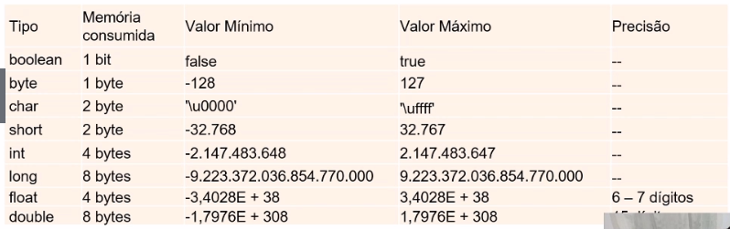

# :back: [README](../../../README.md#programming-languages)

<h1 align="center">
   Tipos em Java
</h1> 

<br>

# Tipagem forte
Significa que, em java, uma vez atribuído um tipo a uma variável, não conseguiremos mudar este tipo.

<br>
<br>

# Tipagem estática
Significa que, em Java, os tipos são verificados em tempo de compilação, diferentemente de uma linguagem de tipagem dinâmica em que a tipagem é verificada em tempo de execução. Isso quer dizer que logo ao compilar o código Java, você já obterá um erro caso atribua um valor incompatível com uma variável.

<br>
<br>


# Casting
Ocorre ao "promovermos" uma variável de um tipo para outro tipo.

> Em java, o único tipo primitivo que **não suporta** casting é o **boolean**. 

<div align="center">

| DE / PARA | byte | short | char | int | long | float | double |
| :-: | :-: | :-: | :-: | :-: | :-: | :-: | :-: |
| **byte** | x | Implícito | char | Implícito | Implícito | Implícito | Implícito |
| **short** | byte | x | char | Implícito | Implícito | Implícito | Implícito |
| **char** | byte | short | x | Implícito | Implícito | Implícito | Implícito |
| **int** | byte | short | char | x | Implícito | Implícito | Implícito |
| **long** | byte | short | char | int | x | Implícito | Implícito |
| **float** | byte | short | char | int | long | x | Implícito |
| **double** | byte | short | char | int | long | float | x |

</div>

Para fazer um casting, basta sinalizar o tipo para o qual se deseja converter entre parênteses, da seguinte forma:

```java
//Conversão do double 5.0 para float.
float a  = (float) 5.0;

//Conversão de double para int.
int b = (int) 5.1987;

//Conversão de int para float é implícito, não precisa de casting.
float c = 100;

//Conversão de char para int é implícito, não precisa de casting.
int d = 'd';
```

O casting ocorre implicitamente quando adiciona uma variável de um tipo menor que o tipo que receberá esse valor.

Exemplo:

```java
/**
 * Exemplo de conversão de tipos primitivos utilizando casting.
 */
public class ExemploCasting {
  public static void main(String[] args) {
    /* Casting feito implicitamente, pois o valor possui um
       tamanho menor que o tipo da variavel que irá recebe-lo. */
    char a = 'a';
    int b = 'b';
    float c = 100;

    System.out.println(a); //Imprime: a
    System.out.println(b); //Imprime: 98
    System.out.println(c); //Imprime: 100.0
    
    /* Casting feito explicitamente, pois o valor possui um tamanho
       maior que o tipo da variavel que irá recebe-lo. */
    int d = (int) 5.1987;
    float e  = (float) 5.0;
    int f = (char) (a + 5);
    char g = (char) 110.5;

    System.out.println(d); //Imprime: 5
    System.out.println(e); //Imprime: 5.0
    System.out.println(f); //Imprime: 102
    System.out.println(g); //Imprime: n
  }
}
```

<br>
<br>

# Inferência de tipo
É a capacidade de criar uma variável sem informar o tipo da mesma.

```java
var numero = 1;
```

É importante ressaltar que mesmo tendo esta possibilidade, a linguagem Java ainda possui tipagem forte, o que significa que uma vez um tipo inferido à variável, não será possível alterá-lo posteriormente.

<br>
<br>

# Atribuição e Referência
As **atribuições** em Java sempre serão por **cópia de valor**.

> Com tipo **primitivo**, copiamos **o valor em memória**.

> Com **objetos**, copiamos **o valor da referẽncia em memória**, sem duplicar o objeto, ou seja, ele aponta para o outro objeto.

<br>
<br>

# Tipos primitivos
Um tipo primitivo **nunca** poderá ter valor igual a `nulo`.

Por não poderem ser nulos, os tipo primitivos tem valores default atribuídos à eles caso não sejam associados a um valor.

Tipos em Java e seus valores default:

<div align="center">

| Tipo |  | Valor default | Consumo de memória | Limites | Exemplo / Descrição |
| :-: | :-: | :-: | :-: | :-: | :-: |
| **boolean** |  | false | 1 bit | true ; false |  |
| **byte** |  | 0 | 1 byte | -128 BETWEEN 127 |  |
| **char** |  | 'u0000' | 2 bytes |  | 'A' ; 15 |
| **short** |  | 0 | 2 bytes | -32768 BETWEEN 32767 |  |
| **int** |  | 0 | 4 bytes | -2147483648 BETWEEN 2147483647 |  |
| **long** |  | 0L | 8 bytes | -9223372036854775808L BETWEEN 9223372036854775807L |  |
| **float** |  | 0.0f | 4 bytes |  | 65f ; 65.5f |
| **double** |  | 0.0d | 8 bytes |  | 1024.99 ; 10.2456 |
| **String** (ou qualquer outro **objeto**) |  | null |  |  | Não é um tipo primitivo, mas sim uma classe que representa uma sequência de caractéres. |

<br>

 

</div>

<br>

> É importante saber que uma variável do tipo primitivo, que não tem um valor atribuído a ela, não pode ser chamada. Porém, uma vez instanciadas, essas variáveis "não iniciadas" terão os valores default associados à elas.

> Valores declarados dentro de um método não serão atribuídos a um valor padrão.

> Valores declarados como variável instanciada ou variável estática terão valores padrão atribuídos.

<br>

1º Exemplo:
```java
public class Main {
    public static void main(String[] args) {
        int a;
        System.out.println(a); //Imprime erro: 'variable a might not have been initialized'
    }
}
```

2º Exemplo:
```java
public class Main {
    static int a;
    public static void main(String[] args) {
        System.out.println(a); //Imprime: 0
    }
}
```

> No primeiro exemplo de código, `a` é uma variável local do **método** `main`. Variáveis ​​locais do método precisam ser inicializadas antes de usá-las.

> No segundo exemplo de código, `a` é variável de membro de classe, portanto, será inicializado com o valor padrão no instanciamento da **classe** `Main`.

<br>

## Wrappers
São objetos (classes) que representam os tipos primitivos do Java. Partilham de muitas características dos objetos primitivos mas têm algumas diferênças.

Podem receber valor `nulo`.

<br>

### Auto-boxing (Wrappers)
| Auto-boxing| Default Value | Lenght (bits) | Limits and Exemples |
| :-: | :-: | :-: | :-: |
| Byte | 0 | 8 | -128 BETWEEN 127 |
| Short | 0 | 16 | -32768 BETWEEN 32767 |
| Integer | 0 | 32 | -2147483648 BETWEEN 2147483647 |
| Long | 0L | 64 | -9223372036854775808L BETWEEN 9223372036854775807L |
| Float | 0.0f | 32 | 65f ; 65.5f |
| Double | 0.0d | 64 | 1024.99 ; 10.2456 |
| Character | 'u0000' | 16 | 'A' ; 15 |
| Boolean | false |  | true ; false |

<br>

### Unboxing (Wrappers)
Acontece quando construímos um objeto e atribuimos este a um tipo primitivo de mesmo tipo.

```java
int i = new Integer(3);

int inteiro = Integer.valueOf(1024);

boolean b1 = Boolean.TRUE;

boolean b2 = Boolean.getBoolean("false");

```

<br>

## Não primitivos
São eles:
-   String
-   Number
-   Object
    -   É o objeto principal do java, todos os objetos "extendem" deste objeto.
-   QualquerOutroObjeto

A grande vantagem de usar estes objetos herdam as muitas propriedades de `object`. 

<br>

