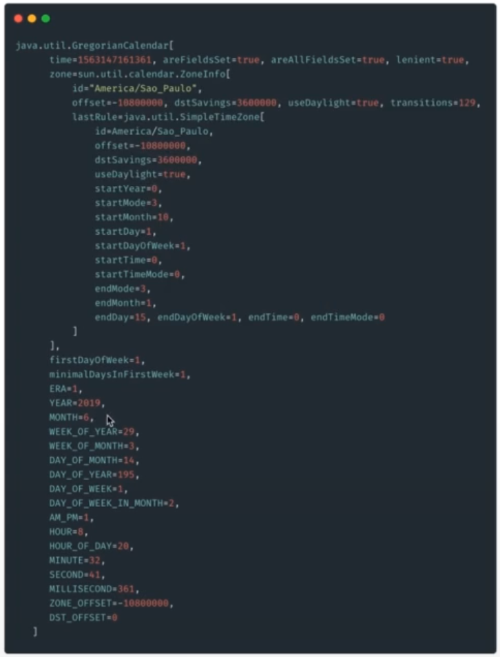

# :back: [README](../../../README.md#programming-languages)

<h1 align="center">
   Tratamento de dados
</h1> 

<br>

# String
Como já visto anteriormente, String é uma classe que representa uma sequência de caractéres. Ela vem dentro do pacote **java.lang**.

Exesitem diversas formas de utilizar uma string, veja:

```java
package com.rodrigofentanes.classes;

public class Programa {
    public static void main(String[] args) {
        var nome = "Rodrigo";
        var sobrenome = "Fentanes";
        final var nomeCompleto = nome + sobrenome;

        System.out.println(nome);
        System.out.println("Nome: " + nome);
        System.out.println("Nome completo: " + nomeCompleto);
        System.out.println("Nome completo: " + nomeCompleto);

        var nomeDaVariavel = new String("Minha string"); // isso é redundante
        
        // Como visto anteriormente, todos os tipos "Não primitivos" herdam métodos e outras características que podem nos ajudar ao construir nossas soluções. Vemos abaixo alguns métodos próprios do tipo String: 

        System.out.println("Char na posição: " + nodaDaVariavel.charAt(5));

        System.out.println("Quantidade de caracteres: " + nodaDaVariavel.lenght());

        // Existem outros métodos próprios da classe que caracteriza o tipo String que são muito úteis.

        // É possível colocar o texto formatado de forma mais legível para quem está codificando, dessa forma temos
        final var mensgem = String.format("Número: %.2f", 1.2345d); // Formata um número e retorna apenas duas casas após o ponto flutuante.

        // StringBuilder
        var texto = "Um text";
        final var builder = new StringBuilder(texto);
        System.out.println(builder.append("o continuação do texto!")); // printa "Um texto continuação do texto!"

        final var reverse = builder.reverse();
        System.out.println(reverse); // printa o texto "!otxet od oãçaunitnoc otxet mU"

        final var insert = reverse.insert(0, "#").insert(reverse.lenght(), "#");
        System.out.println(insert); // printa o texto "#!otxet od oãçaunitnoc otxet mU#"

    }
}
```
## Cheat Sheet (Tipos não primitivos)
 método | Exemplo | Descrição |
| :-: | :-: | :-: |
| charAt | variavel.charAt(5); | Retorna o caractere na posição 5 |
| lenght | variavel.lenght(); | Retorna o tamanho da string |
| trim | variavel.trim(); | Retorna retira os espaços extras em branco |
| toLowerCase | variavel.toLowerCase(); | Retorna a string com todos os caracteres minúsculos |
| toUpperCase | variavel.toUpperCase(); | Retorna a string com todos os caracteres Maiúsculos |
| contains | variavel.contains("N"); | Verifica se a string contém determinado caractere e retrona `true` ou `false` |
| replace | variavel.replace("n", "!"); | Troca determinado caractere por outro, Neste caso onde tem "n" terá "exclamação" |
| equals | variavel.equals("Um texto"); | Verifica se o a string do equals a mesma da variável e retorna `true` ou `false`. É case sensitive. |
| equalsIgnoreCase | variavel.equalsIgnoreCase("Um texto"); | Verifica se o a string do equals a mesma da variável e retorna `true` ou `false`. Não é case sensitive. |
| substring | variavel.substring(1, 6); | Retorna apernas o valor dentro da posição especificada. |
| format | variavel.format("O cliente possui o nome s% e o sobrenome %s", nome, sobrenome); | Mais exemplos em: https://dzone.com/articles/java-string-format-examples <br><br> https://www.javatpoint.com/java-string-format |
| toCharArray | variavel.toCharArray(); |  |
| split | variavel.split(); |  |
| concat | variavel.concat(); |  |
| replaceAll | variavel.replaceAll(); | Nos possibilita trabalhar com regex |

<br>
<br>

# Tratamento de dados

## Dados do tipo Data

| Classe | Método | Exemplo | Descrição |
| :-: | :-: | :-: | :-: |
| java.util.Date | after | after(Date) | Retorna um `boolean`. Checa se o objeto Data de referência é posterior ao comparado |
| java.util.Date | before | before(Date) | Retorna um `boolean`. Checa se o objeto Data de referência é anterior ao comparado |
| java.util.Date | compareTo | compareTo(Date) | Retorna um `int`. Compara dois objetos Data |
| java.util.Date | equals | equals(Date) | Retorna um `boolean`. Checa se os objetos são iguais |
| java.util.Date | getTime | getTime() | Retorna um `long`. Retorna a data em milissegundos |
| java.util.Date | setTime | setTime(long) | Retorna `void`. Define uma data com base em milissegundos |
| java.util.Date | from | from(Instant) | Retorna `static Date`. Define uma data com base em um **Instant** |
| java.util.Date | toInstant | toInstant() | Retorna `Instant`. Retorna um Instant com base em um Date. <br><br> A classe **instant** é imutável e Thread Safe, ela modela um ponto instantâneo de uma linha do tempo. É indicado para gravar marcações temporais em eventos da sua aplicação. |

O `java.util.Date` é a classe responsável por lidar com datas e é também uma das classes mais antigas da linguagem.

Contrutoras da classe `java.util.Date`:

```java
/* construtores depreciados */

Date(int year, int month, int date)

Date(int year, int month, int date, ins hrs, int min)

Date(int year, int month, int date, ins hrs, int min, int sec)

Date(String s)

/* construtores recomendados */

Date() // Este construtor vai alocar um objeto da classe Date e o iniciará com o milissegundo mais próximo do período da sua execução.

Date(long date) // Diferente do construtor anterior, este construtor espera que você passe os milissegundos com base padrão de tempo (epoch) que usa como referência '1 de janeiro de 1970 00:00:00'

// O timestamp epoch é um padrão largamente aceito para representar uma data como um inteiro 32-bits a partir do início do Unix Epoch, isso nos ofere compatibilidade entre libguagens

System.currentTimeMillis() // Este método estático vai nos retornar o milissegundo mais próximo de sua execução com base no sistema operacional

```

```java
import java.util.Date;

public class Exemplo {
    public static void main (String[] args){
        // Date()
        Date novaData = new Date();
        System.out.println(novaData); 
        // Thu Jul 08 09:55:08 BRT 2021

        // Date(long date)
        Long currentTimeMillis = System.currentTimeMillis();
        System.out.println(currentTimeMillis); 
        // 1563127311564
        Date outraData = new Date(currentTimeMillis);
        System.out.println(outraData); 
        // Sun Jul 14 15:01:51 BRT 2019
    }
}
```

<br>

### after & before
```java
import java.util.Date;

public class Exemplo {
    public static void main (String[] args){
        Date dataNoPassado = new Date(1563127311564L);
        Date dataNoFuturo = new Date(1613127311564L);
        Date mesmaDataNoFuturo = new Date(1613127311564L);

        boolean isEquals = dataNoFuturo.equals(mesmaDataNoFuturo); //true
        boolean isEquals = dataNoFuturo.equals(dataNoPassado); //false
        
        boolean compareToCase1 = dataNoPassado.compareTo(dataNoFuturo); // -1
        boolean compareToCase2 = dataNoFuturo.compareTo(dataNoPassado); // 1
        boolean compareToCase3 = dataNoFuturo.compareTo(mesmaDataNoFuturo); // 0
    }
}
```

<br>

### compareTo & equals
```java
import java.util.Date;

public class Exemplo {
    public static void main (String[] args){
        Date dataNoPassado = new Date(1563127311564L);
        Date dataNoFuturo = new Date(1613127311564L);

        boolean isAfter = dataNoPassado.after(dataNoFuturo); //false
        boolean isBefore = dataNoPassado.before(dataNoFuturo); // true
    }
}
```

<br>

### toInstant (Classe Instant)
```java
import java.util.Date;

public class Exemplo {
    public static void main (String[] args){
        Date dataInicio = new Date(1563127311564L); 
        // Tue Dec 22:26:47 BRST 2017

        Instant instante = dataInicio.toInstant(); 
        // 2017-12-13T00:26:47.691Z
    }
}
```

<br>

## java.util.calendar
Existe para facilitar alguns recursos que a classe `Date` oferecia e foram depreciados exatamente pelo fato da `calendar` chegar com facilidades.

Calendar é uma classe abstrata que provê métodos para converter data entre um instante específico.

O calendar possui alguns campos específicos para manipulação como MONTH, YEAR, HOUR, etc.

<br>

### Classe calendar


<br>

### Capturando o instante com calendar
```java
import java.util.Calendar;

public class Exemplo {
    public static void main (String[] args){
        Calendar agora = Calendar.getInstance(); // 
    }
}
```

<br>

### Manipulando datas
```java
import java.util.Calendar;

public class Exemplo {
    public static void main (String[] args){
        Calendar agora = Calendar.getInstance();
        System.out.println("A data corrente é: " + agora.getTime); 
        // Sun Jul 14 20:50:31 BRT 2019

        agora.add(Calendar.DATE, -15);
        System.out.println("15 dias atrás: " + agora.getTime); 
        // Sat Jun 29 20:50:31 BRT 2019
        
        agora.add(Calendar.MONTH, 4);
        System.out.println(a"4 meses depois: " + gora.getTime); 
        // Teu OCT 29 20:50:31 BRT 2019
        
        agora.add(Calendar.YEAR, 2);
        System.out.println("2 anos depois: " + agora.getTime); 
        // Fri Oct 29 20:50:31 BRT 2021
    }
}
```

<br>

### Imprimindo da e horas (Alguns exemplos)
```java
import java.util.Calendar;

public class Exemplo {
    public static void main (String[] args){
        Calendar agora = Calendar.getInstance();
        System.out.println("%tc\n" + agora); 
        // Dom Jul 14 20:58:11 brt 2019
        
        System.out.println("%tF\n" + agora); 
        // 2019-07-14
        
        System.out.println("%tD\n" + agora); 
        // 07/14/19
        
        System.out.println("%tr\n" + agora); 
        // 08:58:11 pm
        
        System.out.println("%tT\n" + agora); 
        // 20:58:11
    }
}
```

<br>

## java.text.DateFormat & java.text.SimpleDateFormat
Oferece maneiras de formatar e parsear a saída das datas.

```java
import java.text.DateFormat;
import java.util.Date;

public class Exemplo {
    public static void main (String[] args){
        Date agora = new Date();

        String dateToStr = DateFormat.getInstance().format(agora)

        System.out.println(dateToStr);
        // 14/07/2019 22:40

        dateToStr = DateFormat.getDateTimeInstance(DateFormat.LONG, DateFormat.SHORT).format(agora);

        System.out.println(dateToStr);
        // 14 de Julho de 2019 22:40

        dateToStr = DateFormat.getDateTimeInstance(DateFormat.LONG, DateFormat.LONG).format(agora);

        System.out.println(dateToStr);
        // 15 de Julho de 2019 22h13min55s BRT
    }
}
```

O SimpleDateFormat trás uma grande facilidade que é definir um padrão de formatação para a saída de data que você deseja, veja:

```java
import java.text.SimpleDateFormat;
import java.util.Date;

public class Exemplo {
    public static void main (String[] args){
        Date agora = new Date();

        SimpleDateFormat formatter = new SimpleDateFormat("dd/MM/yyyy");

        String dataFormatada = formatter.format(agora);

        System.out.println(dataFormatada);
        // 14/07/2019
    }
}
```

<br>

## java.time
É a forma atual de trabalhar com datas. 

<br>

### java.time.LocalDate
É uma classe imutável para representar uma data. Seu formato padrão é `yyyy-MM-dd`

```java
import java.time.LocalDate;

public class Exemplo {
    public static void main (String[] args){
        LocalDate hoje = LocalDate.now();
        System.out.println(hoje);
        // 2019-07-14
        
        LocalDate ontem = hoje.minusDays(1);
        System.out.println(ontem);
        // 2019-07-13
    }
}
```

<br>

### java.time.LocalTime
É uma classe imutável para representar um padrão de hora-minuto-segundo. 

Pode representar até o nível de nanosegundos `12:22:10:123212345`

```java
import java.time.LocalDate;

public class Exemplo {
    public static void main (String[] args){
        LocalDate agora = LocalTime.now();
        System.out.println(agora);
        // 23:53:58:421

        LocalTime maisUmaHora = agora.plusHours(1);
        System.out.println(maisUmaHora);
        // 00:55:37:421
    }
}
```

<br>

### java.time.LocalDateTime
É uma classe imutável e utilizamos para trabalhar com horas e dias.

É possível manipular hora e data com precisão da nanosegundos `2nd October 2007 at 12:22:10:123212345`

```java
import java.time.LocalDateTime;

public class Exemplo {
    public static void main (String[] args){
        LocalDateTime agora = LocalDateTime.now();
        System.out.println(agora);
        // 2019-07-15T00:02:16:076

        LocalDateTime futuro = agora.plusHours(1).plusDays(2).plusSeconds(12);
        System.out.println(futuro);
        // 2019-07-17T01:02:28.076
    }
}
```

<br>
<br>