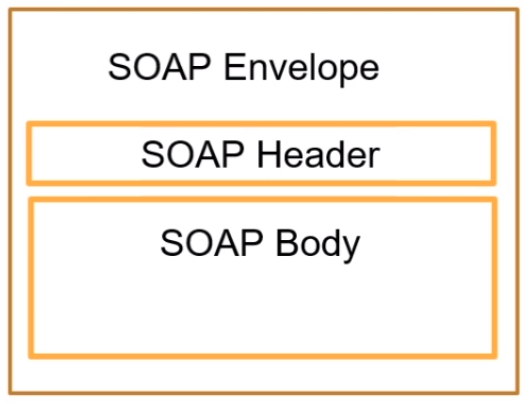
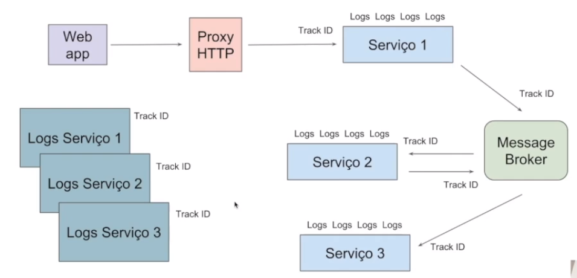

# :back: [README](../../../README.md#fundamentos-da-programação)

<h1 align="center">
    Arquitetura de sistemas web
</h1> 

<br>

# Introdução

# Web Services
Os serviços web são soluções para aplicações se comunicarem independentemente de linguagem, softwares e hardwares utilizados.

Este serviço é útil, por exemplo, quando uma empresa precisar de dados de um serviço externo. Neste caso não é viável uma aplicação ter acesso à dados da outra, mas com um web services a troca de informação torna-se possível, veja abaixo:


> Inicialmente serviços web foram criados para troca de mensagens utilizando a linguagem XML (Extensible Markup Language) sobre o protocolo HTTP sendo identificado por URI (Uniform Resource Identifier) https://woliveiras.com.br/posts/url-uri-qual-diferenca/

> Podemos dizer que serviços web são API's que se comunicam por meio de redes sobre o protocolo HTTP.

Exemplo XML:
```xml
<endereco>
    <cep>99999-99</cep>
    <bairro>Jardim Paulista</bairro>
    <logradouro>Av. Paulista</logradouro>
    <cidade>São Paulo</cidade>
    <numero>99</numero>
</endereco>
```

Exemplo JSON:
```json
{
    "endereco": {
        "cep": "99999-99",
        "bairro": "Jardim Paulista",
        "logradouro": "Av. Paulista",
        "cidade": "São Paulo",
        "numero": "99"
    }
}
```

As vantagens de utilizar serviços web são:
-   Linguagem comum
-   Integração
-   Reutilização de implementação
-   Segurança
-   Custos

As tecnologias mais utilizadas para o desenvolvimento de serviços web são:
-   SOAP (Simple object access Protocol)
-   REST
-   XML (Extensible Markup Language)
-   JSON

<br>
<br>

# SOAP (Simple object access Protocol)
É um **protocolo** criado pela w3c baseado em XML para acessar serviços web principalemnte por HTTP.

Pode-se dizer que SOAP é uma definição de como serviços web se comunicam.

Foi desenvolvido para facilitar integrações entre aplicações.

Permite integrações entre aplicações, independente de linguagem, pois usa como linguagem comum o XML.

É independente da plataforma e software.

Meio de transporte genérico, ou seja, pode ser usado por outros protocolos além do HTTP.

## Estrutura SOAP
O "SOAP message" possui uma estrutura única que deve sempre ser seguida.



## SOAP Envelope
É o primeiro elemento do documento e é usado para encapsular toda a mensagem SOAP.

## SOAP Header
É o elemento onde possui informações de atributos e metadados da requisição.

## SOAP Body
É o elemento que contém os elementos da mensagem.

## SOAP MESSAGE
```xml
<soap:Envelope xmlns:soap="http://www.w3.org/2003/05/soap-envelope">
    <soap:Header>
    </soap:Header>
    <soap:Body>
        <m:MetodoEndereco xmlns:m="http://www.exemple.org.endereco">
            <m:Cidade>Rio de Janeiro</m:Cidade>
            <m:CEP>99999-99</m:CEP>
            <m:Logradouro>Avenida Atlândida</m:Logradouro>
            <m:Numero>99</m:Numero>
        </m:MetodoEndereco>
    </soap:Body>
</soap:Envelope>

```

## XML (Extensible Markup Language)
É uma liguagem de marcação criada pela w3c.

Facilita a separação de conteúdo.

Não tem limitação de criação de tags.

Liguagem comum para integrações entre aplicações.

## WSDL (Web Services Description Language)
É usado para descrever Web Services, funciona como um contrato do serviço.

A descrição é feita em um documento XML, onde é descrito o serviço, especificações de acesso, operações e métodos.

Exemplo de wsdl:
-   http://www.soapclient.com/xml/soapresponder.wsdl

Ferramentas para automação de integração:
-   SoapUi

## XSD (XML Schema Definition)
É um esquema no formato XML usado para definir a estrutura de dados que será validada no XML.

O XSD funciona como uma documentação de como deve ser montado o SOAP Message (XML) que será enviado através de Web Service.

## Exemplo em python de requisição SOAP

```py
from zeep import Client
client = Client('http://www.soapclient.com/xml/soapresponder.wsdl')
result = client.service.Method1(bstrParam1='oi', bstrParam2='tchau')
print(result)
```

<br>
<br>

# REST (Representational State Transfer)
É um estilo/design  de **arquitetura** de software que define a implementação de um serviço web. 

O REST trabalha cmo o **estado** atual do objeto. 

Podem trabalhar com os formatos XML, JSON ou outros.


Vantagens do REST:
-   Permite a integração entre aplicações e também entre cliente e servidor em páginas web e aplicações.
-   Utiliza dos métodos HTTP para definir a operação que está sendo efetuada.
-   Arquitetura de fácil compreensão.

Veja abaixo a estrutura rest:


REST utiliza os métodos HTTP para representar a operação a ser realizada em um determinado recurso.

Principais métodos HTTP:
-   GET (Solicita a representação de um recurso)
-   POST (Solicita a criação de um recurso)
-   DELETE (Solicita a exclusão de um recurso)
-   PUT (Solicita a atualização de um recurso)

> Ao fazer um PUT no postman, por exemplo, para atualizar um dado em nosso sistema, podemos passar a chave no HTTP e os valores a serem atualizados no body da requisição.

## API (Aplication Programming Interface)
São conjuntos de rotinas documentados e disponibilizados por uma aplicação para que outras possam consumir suas funcionalidades.

As maiores plataformas de tecnologia disponibilizam API's para acessos de suas funcionalidades, algumas delas são:
-   Facebook
-   Twitter
-   Telegram
-   Whatsapp
-   GitHub

## JSON (JavaScript Object Notation)
Formatação leve utilizada para troca de mensagens entre sistemas.

Usa-se de uma estrutura de chave e valor e também de listas ordenadas.

Um dos formatos mais populares e mais utilizados para troca de mensagens entre sistemas.

```json
{
    "nome": "Os Vingadores", // chave e valor
    "ano_lancamento": "2019", // chave e valor
    "personagens":[ // lista
        {
            "nome": "Thanos" // chave e valor
        },
        {
            "nome": "Home de ferro" // chave e valor
        },
        {
            "nome": "Thor" // chave e valor
        }
    ]
}
```
> Uma chave sempre tem um valor. Este valor pode ser um dado, outra chave ou até uma lista.

<br>

## Código de estado (Status Code)
É usado pelo servidor para avisar o cliente sobre o estado da operação solicitada:
-   1xx (Informativo)
-   2xx (Sucesso)
-   3xx (Redirecionamento)
-   4xx (Erro do cliente)
-   5xx (Erro do servidor)

> Para mais informações sobre status acesse o site: https://developer.mozilla.org/pt-BR/docs/Web/HTTP/Status

## Ferramentas para consumo de REST API's
-   Postman
-   Thunder Client

## Exemplo em python de quisição REST

```py
import requests

def consulta():
    response = request.get('http//127.0.0.1:5000/pessoa/')
    print(response.status_code)
    print(response.json())
    for pessoa in response.json():
        print(pessoa['id'], pessoa['nome'], pessoa['idade'])

def insere():
    nome = 'Rafael'
    idade = '31'
    pessoa = {"nome": nome, "idade": idade}
    response = request.post('http//127.0.0.1:5000/pessoa/', json=pessoa)
    print(response.status_code)
    print(response.json())

consulta()
# insere()
```

<br>
<br>

# Conceito de Arquiterura em aplicações para internet

<br>
<br>

# Tipos de arquitetrura

## Monolito


<div align="center">

| Pros | Contras |
| :-: | :-: |
| Baixa complexidade | Stack única |
| Monitoramento simplificado | Compartilhamento de recursos |
| - | Acoplamento |
| - | Mais complexo a escalabilidade |

</div>

## Microserviços #1


<div align="center">

| Pros | Contras |
| :-: | :-: |
| Stack dinâmica | Acoplamento |
| Simples escalabilidade | Monitoramento mais complexo |
| - | Provisionamento mais complexo |

</div>

<br>

## Microserviços #2


<div align="center">

| Pros | Contras |
| :-: | :-: |
| Stack dinâmica | Monitoramento mais complexo |
| Simples escalabilidade | Provisionamento mais complexo |
| Desacoplamento | - |

</div>

<br>

## Microserviços #3


<div align="center">

| Pros | Contras |
| :-: | :-: |
| Stack dinâmica | Provisionamento mais complexo |
| Simples escalabilidade | Plataforma inteira depende do gerenciador de pipeline |
| Desacoplamento | - |
| Menor complexidade | - |

</div>

<br>

## Gerenciamento de erros
É um ponto em comum entre todos os tipos de arquitetura.

Onde é mais complexo:
-   Processos asíncronos (Microserviços #2)
-   Pipeline

Solução:
-   Dead letter queue
-   Filas de re-tentativas

<br>

## Gerenciamento de volume de acesso
É um ponto em comum entre todos os tipos de arquitetura.

<br>
<br>

# Internet das coisas / Internet of things (Iot)
A internet das coisas tem o propósito de:
-   Embutir sensores em objetos do dia-a-dia.
-   Coletar dados dos sensores.
-   Usar o dado para tomar decisão.

A internet das coisas passa por trẽs fazes:
-   **As coisas** (Onde coletamos dados)
-   **A nuvem** (Onde armazenamos os dados)
-   **A inteligência** (Onde utilizamos os dados para um propósito)


 Exemplo de iot:


## Computação ubíqua
São tecnologias que se integram à vida do dia-a-dia, ao nosso cotidiano, até serem indistinguíveis dele.

<br>
<br>

# Arquitetura de mensageria
Arquiteturas de mensageria são similares à microserviços:


<div align="center">

| Pros | Contras |
| :-: | :-: |
| Desacoplamento | Single point of failure |
| Facil plug & play | Dificil monitoramento |
| Comunicação assíncrona | - |
| Simples escalabilidade | - |
| Broadcasting | - |
| Permite Event Source | - |

</div>

## Comunicação

Exemplo de comunicação assíncrona simples:


Exemplo de comunicação assíncrona complexa:


## Gerenciamento de erros
Itens importantes ao gerenciar erros:
-   Dead Letter queue (Filas de re-tentativas)
-   Monitoramento entre serviços
-   Rastreamento de fluxo

## Inconsistência de dados


## Rastreamento de fluxo



Business intelligenca