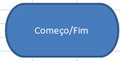
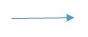
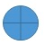
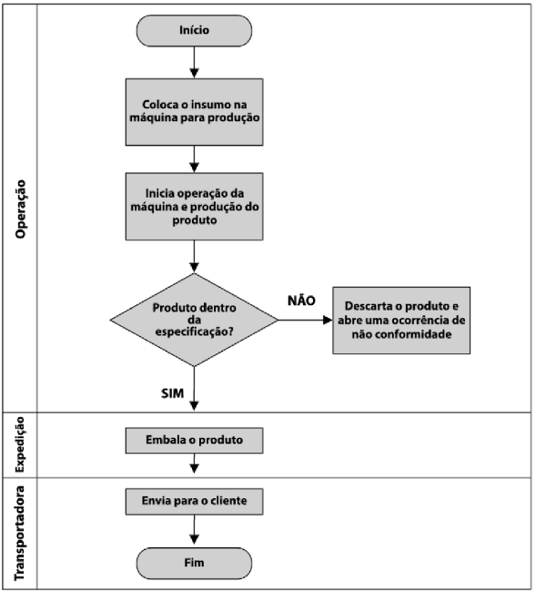

# :back: [README](../../../README.md#programming-fundamentals)

<h1 align="center">
    Introdução à programação
</h1> 

<br>

# Algoritmos
A definição de algorítmos pode se especificar a depender do escopo.

<br>

## Em **lógica de programação**
Um algoritmo é uma sequência de passos para resolver um problema.

<br>

## Em **estrutura de dados**
Um algoritmo é um conjunto de instruções estruturadas e ordenadas. Seu objetivo é realizar uma tarefa ou operação específica.

<br>
<br>

# Abstração
Abstração é a habilidade de concentrar nos aspectos essenciais de um contexto qualquer, ignorando características menos importantes ou acidentais, ou seja, nada mais é que abordar um problema extenso da forma mais simples possível.

<br>
<br>

# Pseudocódigo
É uma forma genérica de escrever um algoritmo, utilizando uma linguagem simples, como a linguagem falada ou escrita nativamente, de forma que possa ser entendida por qualquer pessoa, ou seja, é como escrever num papel qualquer o passo-a-passo das tarefas a serem feitas durante o dia por exemplo.

<br>
<br>

# Concatenação
É a operação de unir dois ou mais conteúdos.

```java
String x = "Uma frase qualquer ";
int b = 2; 
System.out.println("Texto " + x + b);
// A saída será:
// 'Texto Uma frase qualquer 2'
```

<br>
<br>

# Fluxograma
Sendo uma ferramenta, o fluxograma, é utilizada para **representar graficamente o algoritmo**, isto é, a sequência lógica e coerente do **fluxo de dados**. Pode ser visto como um tipo de diagrama e pode ser entendido como uma representação esquemática de um processo. Podemos entendê-lo, na prática, como a documentação dos passos necessários para a execução de um processo qualquer.

<br>

## Operação

| Símbolo | Nome | Descrição |
| :-: | :-: | :-: |
|  | Começo e fim | Indica o começo ou fim de um processo . |
|  | Processo / Atividade | Mostra uma etapa do processo. Este é o símbolo mais comum nos fluxogramas. |
|  | Processo pré-definido | Indica outra etapa do processo que está descrita em outro lugar. |
|  | Processo alternativo | Usado quando a atividade é uma alternativa a atividade normal. |
|  | Espera / Atraso | Representa qualquer período de espera que fizer parte do processo. |
|  | Preparação | Representa uma configuração para outra etapa do processo: algo deve ser feito, ajustado ou modificado antes de prosseguir o processo. |
|  | Operação manual | Indica as etapas que não são automatizadas e que vão se repetir até que seja parada manualmente. |

<br>

## Ramificação e controle do fluxo

| Símbolo | Nome | Descrição |
| :-: | :-: | :-: |
|  | Fluxo de linha	 | Conectores de símbolos que mostram a direção que corre o processo. |
|  | Terminação | Mostra os pontos de início e fim de um processo. |
|  | Decisão | Indica um ponto de decisão do processo,  apresentando duas possibilidades de caminhos para o fluxo de acordo com as condições estipuladas na decisão. |
|  | Conector | É utilizado como conector para ligar um ponto ao outro no fluxo, normalmente identificados com letras maiúsculas (A , BB) |
|  | Conector fora de página	 | Mostra a continuação do processo para outro processo desenhado em outra página. |
|  | Mesclar | Representa a fusão de vários processos ou informações em um só. |
|  | Extrair | Mostra quando um processo divide-se em caminhos paralelos. |
|  | Ou | Indica que o fluxo do processo continua em duas ou mais direções. |
|  | Somador | Representa a etapa em que vários passos convergem em um único processo. |

<br>

## Entrada e saída

| Símbolo | Nome | Descrição |
| :-: | :-: | :-: |
|  | Dados (I/O) | Indica as entradas e saídas do processo. |
|  | Documento | Mostra um processo que gera um documento. |
|  | Vários documentos | Mostra um processo que gera vários documentos. |
|  | Exibição | Indica um passo do processo onde a informação é exibida para uma pessoa. |
|  | Entrada manual | Representa a etapa em que uma pessoa deve inserir informações manuais. |

<br>

## Armazenamento de arquivos e informações 

| Símbolo | Nome | Descrição |
| :-: | :-: | :-: |
|  | Dados armazenados | Indica uma etapa onde os dados são armazenados. |

<br>

## Processamento de dados

| Símbolo | Nome | Descrição |
| :-: | :-: | :-: |
|  | Agrupar | Indica uma etapa e que os dados devem ser organizados de uma forma padrão. |
|  | Classificar | Representa uma etapa do processo em que os dados devem ser classificados em uma ordem pré-definida. |

<br>
<br>

# Tipos de fluxograma

## Fluxograma de processo simples
É um diagrama de blocos que contém pontos de decisão. Indica a sequencia de funcionamento em processos simples, que depende de uma condição para executar um tipo de tarefa.

 

<br>

## Fluxograma funcional
Mostra a sequência de atividades de um processo entre as áreas ou seções por onde ele acontece. É muito útil para processos transversais, que passam por diversas áreas até ser concluído. Nele se inclui também os responsáveis pelos setores e pode até indicar gargalos no processo.

 
