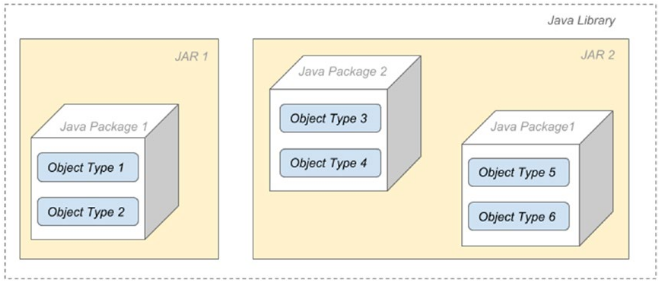

# :back: [README](../../../README.md#programming-languages)

<h1 align="center">
   JARs (<b>J</b>ava <b>Ar</b>chieves) - Java
</h1>

Os arquivos `*.java` são compilados e transformados em `*.class`, estes por sua vez serão organizados de acordo com a estrutura de pacotes e então empacotados em um ou mais arquivos JAR.

O código em um pacote pode abranger vários JARs, dessa forma se você tiver mais de um subprojeto em seu projeto, poderá ter o mesmo nome de pacote repetido desde que estes pacotes contenham classes diferentes. Veja abaixo:

> Quando os JARs são hospedados num repositporio, como The Maven Public Repository, eles são chamados de artefatos (`artifacts`) ou Java Modules.

 
 

# The JAR Hell
A estrura vista no capítulo acima resulta diversos problemas para projetos mais complexos, dentre eles:
-  Packages scattered in multiple jars
-  Transitive dependencies between jars which sometimes leads to different versions of the same class on the classpath
-  Missing transitive dependencies
-  Accessibility problems.

No Java 9 este problema foi resolvido através da criação de mais um nível de agrupamento de pacotes, os Módulos.

 
 

