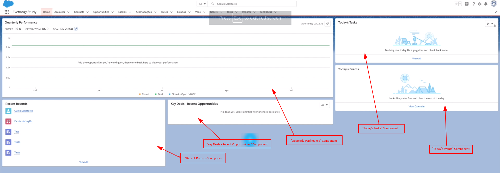
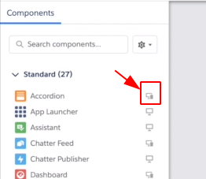
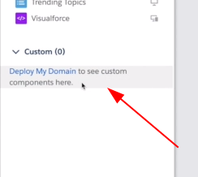
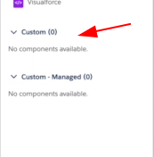
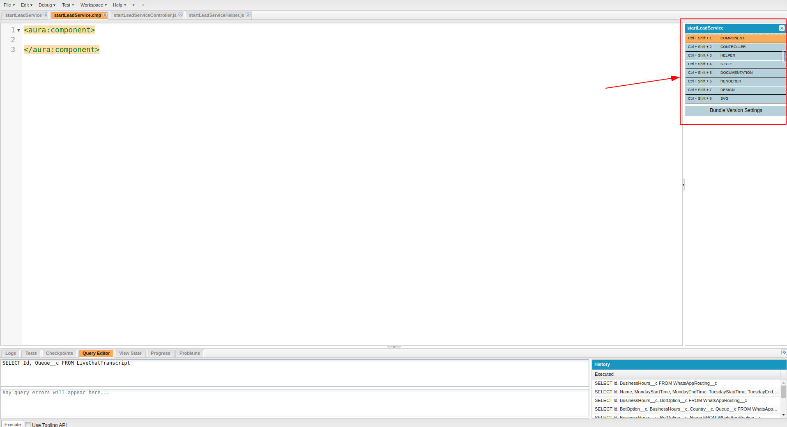

# :back: [README](../../../README.md#programming-languages)

<h1 align="center">
    Lightning Component
</h1> 

<br>

# Introdução
Um **Lightning Component** é um conjunto de HTML, CSS, JavaScript. Foi desenvolvimdo com o objetivo de possibilitar a criação de componentes reutilizáveis e de alta performance.

Um **Lightning Component** pode ou não:
-   Fazer comunicação com o Backend. 
-   Ser composto por outros componentes.

> Em uma única tela podemos ter vários componentes e estes componentes podem conversar entre eles através de **eventos**.

> Um componente pode estar dentro de outro componente e assim por diante.

<br>

## Criação
Um **Lightning Component** pode ser criado e editado pelo Developer Console. Basta clicarmos no menu **File > New > Lightning Component**. Criado desta forma podemos escolher se este componente será:
-   Lightning Tab
-   Lightning Page
-   Lightning Record Page
-   Lightning Communities Page
-   Lightning Quick Action 

Também pode ser criado através do **Lightning App Builder** ou através do **VSCode**. 

<br>

## Tipos
Existem dois tipos de **Lightning Component**, são eles:
1.  Aura Component
2.  Lightning web Component 

<br>

## Características
Observe a tela abaixo:



> Na imagem acima vemos setas vermelhas apontadas para cada componente.

> Para ser mais acertivo, tudo que vemos dentro do Salesforce é um component do lightning

<br>

## Compatibilidade
Os Lightning Components são compatíveis com todos os brownsers suportados pela plataforma Salesforce.

<br>

## Customização
É "simples" customizar um lightning component e dessa forma é possível "levar" o poder de customização para um administrador do sistema.

<br>
<br>

# Lightning app builder
O **Lightning App Builder** está disponível no menu de configurações. Basta pesquisar por "App Builder" e clicar na opção "Lightning App Builder", nele poderemos ver todas as **Lightning Pages**.

Existem três opções de **Lightning Pages**, são elas:
-   App Page
-   Home Page
-   Record Page

> O Salesforce tem a opção "Editar página" disponível no ícone da lateral superior direita com a imagem de uma "engrenagem" que nos levará direto para a página de edição do "Lightning App Builder". Esta opção estará disponível apenas quando acessarmos um "layout de página". O Editor de Páginas do "Lightning App Builder" é uma ferramenta intuitiva para edição e customização de componentes.

> No App Builder é possível definir,por exemplo, "Default Tab", Ordenar os Itens, Títulos e tudo mais.

<br>

## App Page


<br>

## Home Page


<br>

## Record Page


<br>
<br>

# Components

## Standard Components
Os Standard Components ficam disponíveis na tela de edição do App Builder.

> Note que na lateral de cada App teremos um ícone pequeno que indicará se este componente é compatível com Celular, Desktop, etc. Veja na imagem abaixo:



<br>

## Custom Components
Para criarmos nossos próprios componentes nós também precisamos ter nosso próprio domínio configurado e ativo.



> Para utilizar qualquer componente que não seja Standard do Salesforce é necessário ter o domínio configurado e ativo.

<br>

Após a configuração e ativação do domínio a mensagem da imagem anterior irá sumir e ficará da seguinte forma:



> Note que também temos o dropdown "Custom - Managed (0)", neste ficarão todos os componentes vindos do AppExchange.

<br>

A opção de criar nossos próprios componentes nos abre a possibilidade de criar nossos próprios aplicativos e disponibilizá-los na **AppExchange**.

> AppExchange é uma galeria onde encontraremos produtos, componentes, etc. 

<br>

## AppExchange
É uma galeria disponibilizada pelo próprio Salesforce para que possamos adquirir componentes, produtos e muito mais. Para acessá-la, basta olhar no rodapé da página do App Builder e assim veremos a opção "Get more on the AppExchange", nesta opção iremos encontrar a página do AppExchange.

<br>
<br>

# Lightning Design System
Se assemelha ao bootstrap, ou seja, é um framework frontend. Assim como o bootstrap ele também é open-source. O Lightning Design System pode ser utilizado em qualquer site, este sendo ou não salesforce.

> Link: https://www.lightningdesignsystem.com/ (Neste teremos a área de "Component Blueprints" onde iremos encontrar amostras de componentes já prontos ou "Utilities" onde iremos encontrar formatações, grids, etc ou até mesmo ícones)

> Extensão útil: https://marketplace.visualstudio.com/items?itemName=salesforce.salesforce-vscode-slds

> Github: https://github.com/salesforce-ux/design-system

> Também é possível ver os exemplos de componentes pelo link: https://developer.salesforce.com/docs/component-library/overview/components

<br>
<br>

# Trabalhando com um Componente Lightning
Podemos abrir um componente Lightning indo em **Developer Console** > **Open Lightning Resources** > **nomeDoComponente**, assim a seguinte tela irá abrir:



> Na imagem acima, no canto superior direito, podemos ver um menu que nos ajuda a ver todas as partes de um componente.

<br>
<br>

# Partes de um componente

## COMPONENT
Define todo o conteúdo HTML do nosso componente. Além de registrar eventos e atributos dos nossos componentes.

<br>

## CONTROLLER
É escrita em javascript e é a responsável por toda a lógica do nosso componente, sendo assim é responsável por lidar/manipular tudo o que acontece na view. 

<br>

## HELPER
Parece muito com a CONTROLLER mas tem como principal função ter todo trecho de código que pode ser consumido por mais de uma parte do nosso componente. 

É boa prática colocar toda chamada ao Apex dentro da HELPER.

Logo a HELPER serve como meio de campo.

<br>

## STYLE
É similar ao css, porém sempre tem o **.THIS** no início de cada estilo, veja:

```css
.THIS .borda{
    border: none;
}
```

<br>

## DOCUMENTATION
É onde podemos documentar o nosso componente, logo é que onde iremos colocar as informações necessárias para que outros desenvolvedores possam entender nosso componente.

<br>

## RENDERER
É responsável por todo ciclo de vida do componente. São quatro tipos básicos:

1.  render()
    -   Quando o body do componente estiver sendo renderizado ele chamará o método **render()**.
2.  rerender()
    -   Toda vez que o seu componente for renderizado novamente, ou seja, quando ele receber um evento ou quando um atributo for alterado, aí ele chamará o método **rerender()**.
3.  afterRender()
    -   Toda vez que o componente terminar de ser renderizado ele chamará  método **afterRender()**.
4.  unRender()
    -   Toda vez que o componente for eliminado da tela ou for fechado inesperadamente então ele chamará o método **unRender()**. Esta é uma forma de "matar" o componente de forma mais "controlada".

<br>

## DESIGN
Permite customizar como o administrador irá interagir com o componente ao acessá-lo pelo Lightning App Builder. Ou seja, neste podemos definir o que é customizável e o que não é.

É uma forma de pegar dados que um administrador inseriu na tela do Lightning App Builder e utilizar esses dentro do componente.

<br>

## SVG
Espea um SVG. SVG é um arquivo XML com instruções para renderizar uma imagem no formato vetorial, basicamente o SVG irá representar o ícone do componenten na paleta de ícones do Lightning App Builder.

<br>
<br>

# Criação de uma controller

## AuraEnable

Segue abaixo o exemplo de uma classe Apex que servirá como controller:


```java
public with sharing class TicketsController {

    @AuraEnabled (cacheable=true)
    public static List<Aeroporto__c> getAeroportos(String search) {
        search += '%';
        return [
            SELECT Id,
                Name,
                Estado__r.name
                Sigla__c
            FROM Aeroporto__c
            WHERE Name LIKE :search OR
                Sigla__c LIKE :search
            WITH SECURITY_ENFORCED
        ]
    }

    public static Ticket__c createTicket(String accountId String vooIdaId String vooVoltaId) {
        if(Schema.SObjectType.Ticket__c.isCreatable()) {
            Ticket__c ticket = new Ticket__c();

            if(Schema.SObjectType.Ticket__c.fields.Account__c.isCreatable()) {
                ticket.Account__c = accountId;
            }
            if(Schema.SObjectType.Ticket__c.fields.Voo_Ida__c.isCreatable()) {
                ticket.Voo_Ida__c = vooIdaId;
            }
            if(Schema.SObjectType.Ticket__c.fields.Voo_Volta__c.isCreatable()) {
                ticket.Voo_Volta__c = vooVoltaId;
            }

                insert ticket;

            
            return ticket;
        } else {
            throw new auraHandledException('Você não tem permissão para criar um ticket.');
        }
    }

    public class foobarTO {
        @AuraEnabled
        public Foo__c foo;
        @AuraEnabled
        public Bar__c bar;

        public void foobar(Foo__c foo, Bar__c bar) {
            this.foo = foo;
            this.bar = bar;
        }
    }
}
```

> O trecho `@AuraEnabled` fará com que o método **getAeroportos** fique disponível para todos os componentes Lightning, seja ele Aura Component, Lightning componente ou Light Web Component.

> O trecho `(cacheable=true)` garantirá que se a pessoa estiver com o componente aberto e fizer a mesma pesquisa mais de uma vez, o componente não fará uma nova busca, evitando assim chamadas desnecessárias para o nosso backend.

> O trecho `search += '%'` é importante para que o LIKE funcione corretamente em tempo de digitação.

> O trecho `WITH SECURITY_ENFORCED` garante que quem o usuário que terá acesso aos dados retornados é um usuário que tem permissão para ver os dados retornados, ou seja, o usuário tem as devidas permissões para visualizar os campos que estão sendo selecionados

> O trecho `Schema.SObjectType.Ticket__c.isCreatable()` retorna true para o caso do usuário poder criar registros de determinado tipo, neste caso do tipo **Ticket__c**.

> O trecho `Schema.SObjectType.Ticket__c.fields.Account__c.isCreatable()` serve para verificar se o usuário tem as devidas permissões para criar determinados campos, neste caso o campo **Account__c**

> O trecho `throw new auraHandlerException()` é utilizado para retornar um erro de sistema.

> Na nomenclatura da classe `foobarTO` o "TO" significa "Transcript Object". Este tipo de classe EXISTE PARA CONTINUE A DIGITAR AQUI...


> Observe que dentro da classe `foobarTO` foi necessário "setar" os dois atributos da classe com um **@AuraEnabled**. Isso foi necessário pois sem isso não seria possível visualizar estas propriedades dentro de um componente. 

<br>
<br>

# Estrutura básica de um componente

Regras:
-   Deve começar com **letra** ou **_**
-   Deve conter somente caracteres **alfanuméricos** ou **_**

Tipo suportados:
-   SObject
-   Boolean
-   Date
-   Datetime
-   Decimal
-   Double
-   Integer
-   Long
-   String
-   Array[]

Exemplo de código:

```xml
<aura:component implements="flexipage:availableForAllPageTypes" access="global">

    <aura:attribute name="whom" type="String" default="World">
    <aura:attribute name="valor" type="Decimal" default="200">
    <aura:attribute name="moeda" type="String" default="USD">

    <lightning:card>
        {!v.whom}
    </lightning:card>

    <div class="seta"></div>

    <lightning:formattedNumber value="{!v.valor}" style="currency" currencyCode="{!v.moeda}" currencyDisplayAs="code"></lightning:formattedNumber>

    <lightning:button variant="brand" label="Iniciar atendimento" title="Iniciar atendimento" onclick="{!c.handlerClick}"></lightning:button>


</aura:component>
```

> O valor **World** de `default="World"` será convertido para o tipo passado no valor da propriedade type `type="String"` ou seja **String**.

> `aura:attribute` é uma tag.

> Os atributos carregarão os valores que serão mostrados em uma tela.

> O trecho `access="global"` nos permitirá acessar este componente de qualquer página.

> No trecho `{!v.whom}` o "v" significa view. Este trecho de código irá mostrar na tela do valor "World" do tipo "String".

> Note que no trecho `onclick="{!c.handlerClick}"` temos um "c" de "controller". Serve para referenciar nosso controller.

<br>

O classe controller (**nomeDoComponenteController.js**) ficará similar ao exemplo abaixo:
```javascript
({
    handlerClick : function(component, event, helper) {
        window.console.log('Clique OK');
    }
})
```

> É possível fazer um debug utilizando o `window.console.log('mensagem')`.

<br>

O arquivo css ficará similar ao trecho de código abaixo:
```css
.THIS .seta {
    border-bottom: solid thin black;
    min-width: 200px;
    height: 20px;
}
```

<br>

Após criar nosso componente básico, basta ir no Salesforce em "editar página" e adicionar o componente no local desejado para ver o resultado.

> A depender de como a Org esteja configurada, pode ser que o desenvolvedor sofra um pouco com Cache ao recarregar as páginas constantemente para verificar as modificações feitas. Para melhorar este ponto podemos ir em **Setup** > **Session Settings** e então desmarcar o item **Enable secure and persistent browser cache to improve performance**. Esta manobra **NÃO É RECOMENDADA** em produção, pode ser utilizada apenas para fins de desenvolvimento e produtividade.

<br>
<br>

# Aura Iteration
É uma forma de a partir de um código HTML conseguir iterar sobre vários itens de uma lista. Veja abaixo:

```xml
<aura:iteration items="{!v.foos}" var="foo">
</aura>
```

> O trecho que contem a propriedade que utiliza a palavra-reservada "items" `items="{!v.foos}"` se refere ao **array** e o trecho que contem a propriedade que utiliza a palavra-reservada "var" `var="foo"` se refere à variável.


