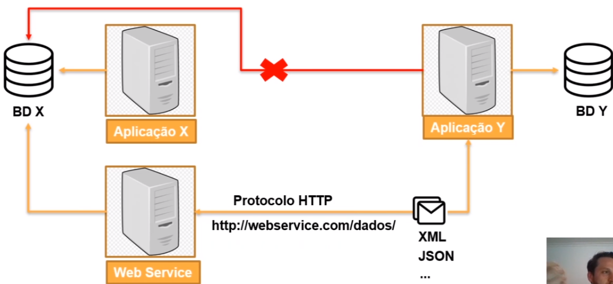
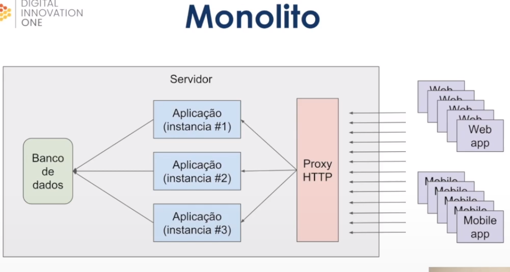
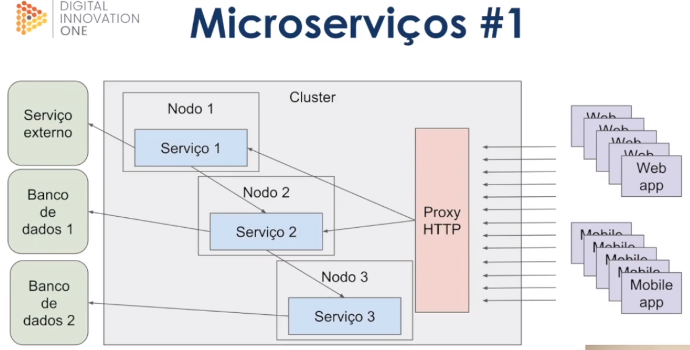
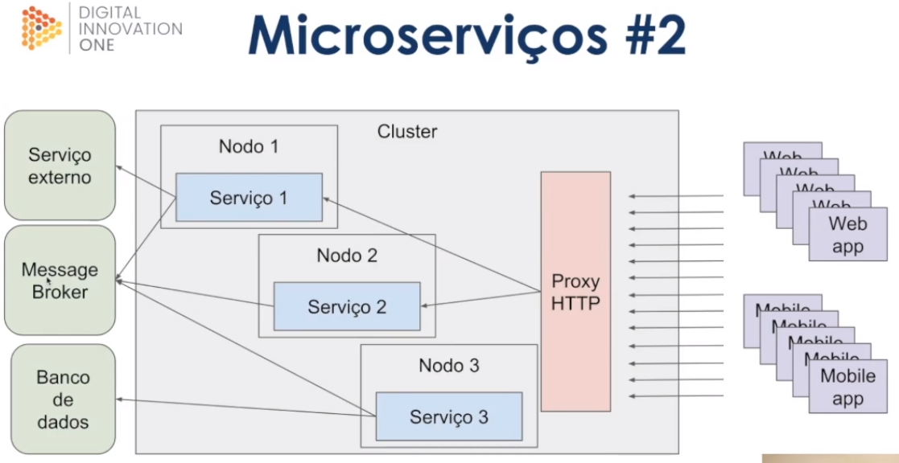
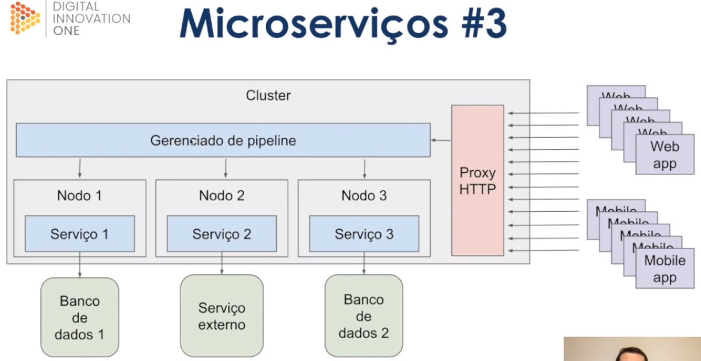
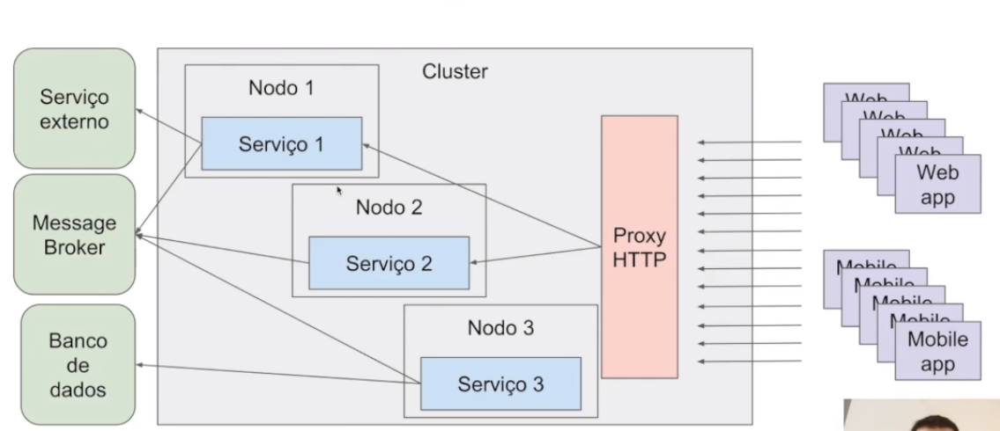
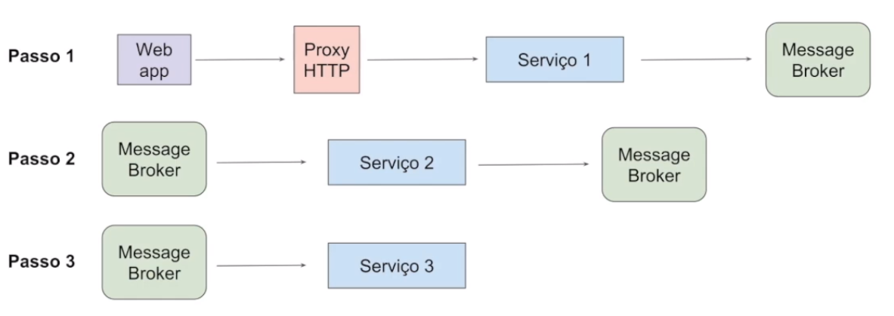
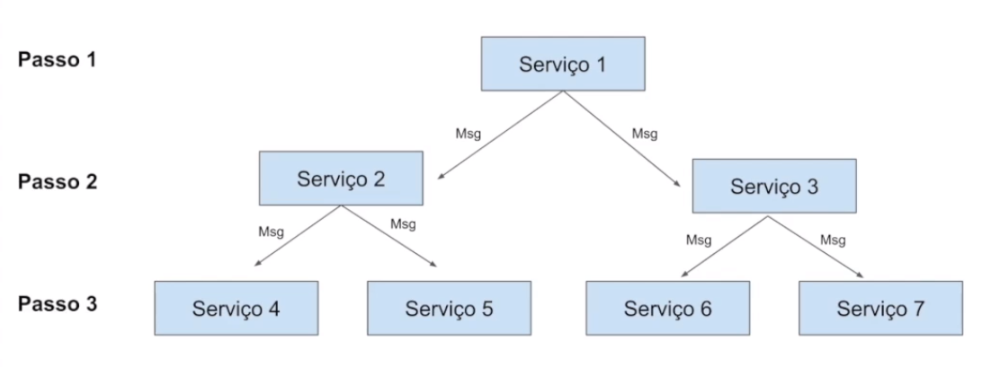
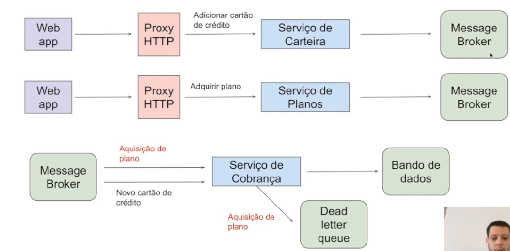
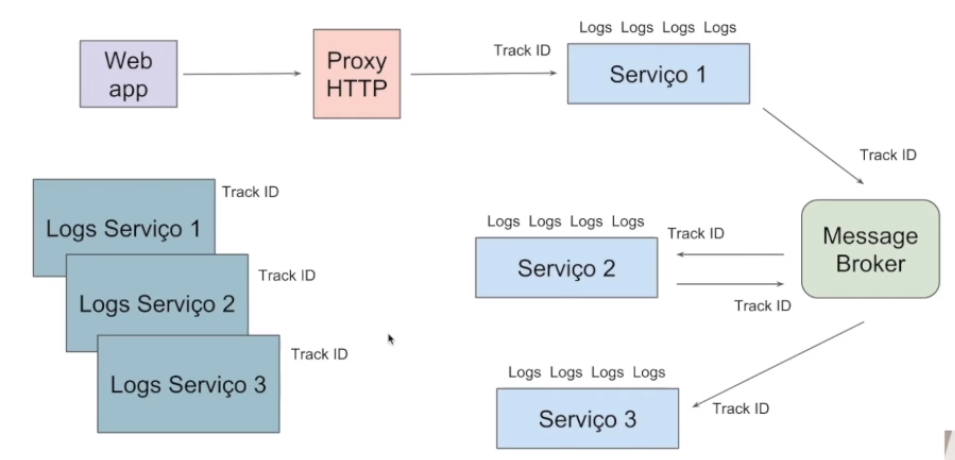

# :back: [README](../../../README.md#fundamentos-da-programação)

<h1 align="center">
    Arquitetura de sistemas web
</h1> 

<br>

# Web Services
Os serviços web são soluções para aplicações se comunicarem independentemente de linguagem, softwares e hardwares utilizados.

Este serviço é útil, por exemplo, quando uma empresa precisar de dados de um serviço externo. Neste caso não é viável uma aplicação ter acesso à dados da outra, mas com um web services a troca de informação torna-se possível, veja abaixo:



> Inicialmente serviços web foram criados para troca de mensagens utilizando a linguagem XML (Extensible Markup Language) sobre o protocolo HTTP sendo identificado por URI (Uniform Resource Identifier) https://woliveiras.com.br/posts/url-uri-qual-diferenca/

> Podemos dizer que serviços web são API's que se comunicam por meio de redes sobre o protocolo HTTP.

Exemplo XML:
```xml
<endereco>
    <cep>99999-99</cep>
    <bairro>Jardim Paulista</bairro>
    <logradouro>Av. Paulista</logradouro>
    <cidade>São Paulo</cidade>
    <numero>99</numero>
</endereco>
```

Exemplo JSON:
```json
{
    "endereco": {
        "cep": "99999-99",
        "bairro": "Jardim Paulista",
        "logradouro": "Av. Paulista",
        "cidade": "São Paulo",
        "numero": "99"
    }
}
```

As vantagens de utilizar serviços web são:
-   Linguagem comum
-   Integração
-   Reutilização de implementação
-   Segurança
-   Custos

As tecnologias mais utilizadas para o desenvolvimento de serviços web são:
-   SOAP (Simple object access Protocol)
-   REST
-   XML (Extensible Markup Language)
-   JSON

<br>
<br>

# Tipos de arquitetrura

## Monolito


<div align="center">

| Pros | Contras |
| :-: | :-: |
| Baixa complexidade | Stack única |
| Monitoramento simplificado | Compartilhamento de recursos |
| - | Acoplamento |
| - | Mais complexo a escalabilidade |

</div>

## Microserviços #1


<div align="center">

| Pros | Contras |
| :-: | :-: |
| Stack dinâmica | Acoplamento |
| Simples escalabilidade | Monitoramento mais complexo |
| - | Provisionamento mais complexo |

</div>

<br>

## Microserviços #2


<div align="center">

| Pros | Contras |
| :-: | :-: |
| Stack dinâmica | Monitoramento mais complexo |
| Simples escalabilidade | Provisionamento mais complexo |
| Desacoplamento | - |

</div>

<br>

## Microserviços #3


<div align="center">

| Pros | Contras |
| :-: | :-: |
| Stack dinâmica | Provisionamento mais complexo |
| Simples escalabilidade | Plataforma inteira depende do gerenciador de pipeline |
| Desacoplamento | - |
| Menor complexidade | - |

</div>

<br>

## Gerenciamento de erros
É um ponto em comum entre todos os tipos de arquitetura.

Onde é mais complexo:
-   Processos asíncronos (Microserviços #2)
-   Pipeline

Solução:
-   Dead letter queue
-   Filas de re-tentativas

<br>

## Gerenciamento de volume de acesso
É um ponto em comum entre todos os tipos de arquitetura.

<br>
<br>

# Arquitetura de mensageria
Arquiteturas de mensageria são similares à microserviços:



<div align="center">

| Pros | Contras |
| :-: | :-: |
| Desacoplamento | Single point of failure |
| Facil plug & play | Dificil monitoramento |
| Comunicação assíncrona | - |
| Simples escalabilidade | - |
| Broadcasting | - |
| Permite Event Source | - |

</div>

<br>

## Comunicação

Exemplo de comunicação assíncrona simples:


Exemplo de comunicação assíncrona complexa:


<br>

## Gerenciamento de erros
Itens importantes ao gerenciar erros:
-   Dead Letter queue (Filas de re-tentativas)
-   Monitoramento entre serviços
-   Rastreamento de fluxo

<br>

## Inconsistência de dados



<br>

## Rastreamento de fluxo



Business intelligence