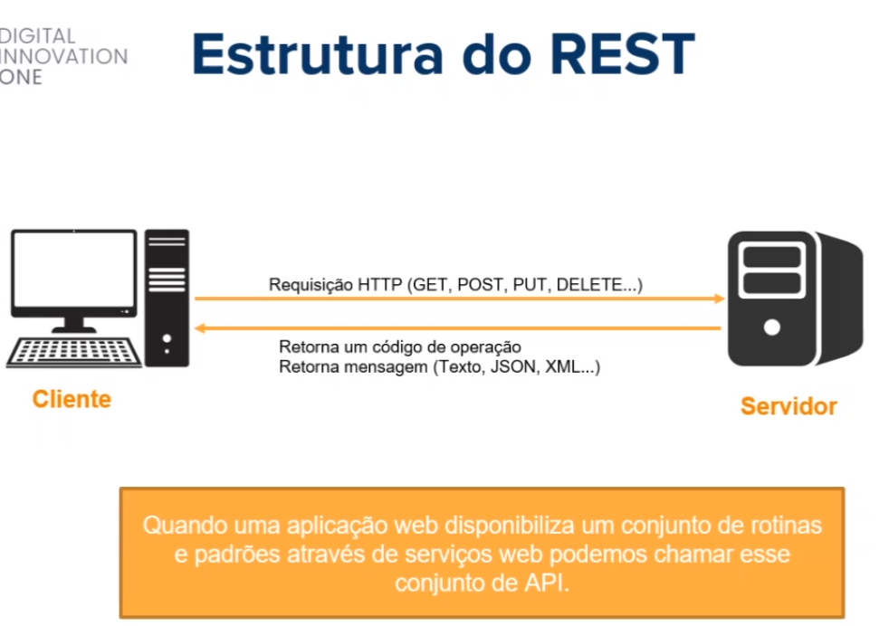

# :back: [README](../../../README.md#web-development)

<h1 align="center">
    REST (Representational State Transfer)
</h1> 

## Intro
REST é um estilo/design  de **arquitetura** de software que define a implementação de um serviço web. 

O REST trabalha cmo o **estado** atual do objeto. 

Podem trabalhar com os formatos XML, JSON ou outros.

Vantagens do REST:
-   Permite a integração entre aplicações e também entre cliente e servidor em páginas web e aplicações.
-   Utiliza dos métodos HTTP para definir a operação que está sendo efetuada.
-   Arquitetura de fácil compreensão.

Veja abaixo a estrutura rest:



REST utiliza os métodos HTTP para representar a operação a ser realizada em um determinado recurso.

Principais métodos HTTP:
-   GET (Solicita a representação de um recurso)
-   POST (Solicita a criação de um recurso)
-   DELETE (Solicita a exclusão de um recurso)
-   PUT (Solicita a atualização de um recurso)

> Ao fazer um PUT no postman, por exemplo, para atualizar um dado em nosso sistema, podemos passar a chave no HTTP e os valores a serem atualizados no body da requisição.

<br>

## JSON (JavaScript Object Notation)
Formatação leve utilizada para troca de mensagens entre sistemas.

Usa-se de uma estrutura de chave e valor e também de listas ordenadas.

Um dos formatos mais populares e mais utilizados para troca de mensagens entre sistemas.

```json
{
    "nome": "Os Vingadores", // chave e valor
    "ano_lancamento": "2019", // chave e valor
    "personagens":[ // lista
        {
            "nome": "Thanos" // chave e valor
        },
        {
            "nome": "Home de ferro" // chave e valor
        },
        {
            "nome": "Thor" // chave e valor
        }
    ]
}
```
> Uma chave sempre tem um valor. Este valor pode ser um dado, outra chave ou até uma lista.

<br>

## Código de estado (Status Code)
É usado pelo servidor para avisar o cliente sobre o estado da operação solicitada:
-   1xx (Informativo)
-   2xx (Sucesso)
-   3xx (Redirecionamento)
-   4xx (Erro do cliente)
-   5xx (Erro do servidor)

> Para mais informações sobre status acesse o site: https://developer.mozilla.org/pt-BR/docs/Web/HTTP/Status

## Ferramentas para consumo de REST API's
-   Postman
-   Thunder Client

## Exemplo em python de quisição REST

```py
import requests

def consulta():
    response = request.get('http//127.0.0.1:5000/pessoa/')
    print(response.status_code)
    print(response.json())
    for pessoa in response.json():
        print(pessoa['id'], pessoa['nome'], pessoa['idade'])

def insere():
    nome = 'Rafael'
    idade = '31'
    pessoa = {"nome": nome, "idade": idade}
    response = request.post('http//127.0.0.1:5000/pessoa/', json=pessoa)
    print(response.status_code)
    print(response.json())

consulta()
# insere()
```

<br>
<br>