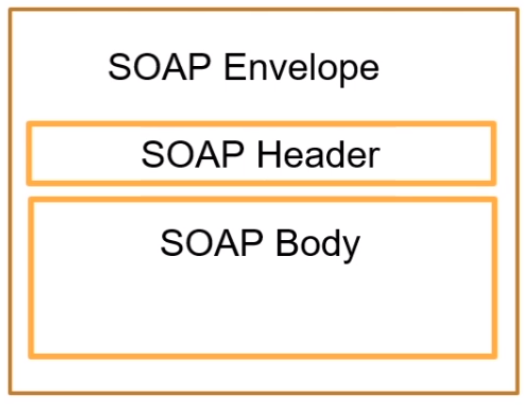

# :back: [README](../../../README.md#fundamentos-da-programação)

<h1 align="center">
    SOAP (Simple object access Protocol)
</h1> 

<br>

# Introdução
SOAP é um **protocolo** criado pela w3c baseado em XML para acessar serviços web principalemnte por HTTP.

Pode-se dizer que SOAP é uma definição de como serviços web se comunicam.

Foi desenvolvido para facilitar integrações entre aplicações.

Permite integrações entre aplicações, independente de linguagem, pois usa como linguagem comum o XML.

É independente da plataforma e software.

Meio de transporte genérico, ou seja, pode ser usado por outros protocolos além do HTTP.

## Estrutura SOAP
O "SOAP message" possui uma estrutura única que deve sempre ser seguida.



## SOAP Envelope
É o primeiro elemento do documento e é usado para encapsular toda a mensagem SOAP.

## SOAP Header
É o elemento onde possui informações de atributos e metadados da requisição.

## SOAP Body
É o elemento que contém os elementos da mensagem.

## SOAP MESSAGE
```xml
<soap:Envelope xmlns:soap="http://www.w3.org/2003/05/soap-envelope">
    <soap:Header>
    </soap:Header>
    <soap:Body>
        <m:MetodoEndereco xmlns:m="http://www.exemple.org.endereco">
            <m:Cidade>Rio de Janeiro</m:Cidade>
            <m:CEP>99999-99</m:CEP>
            <m:Logradouro>Avenida Atlândida</m:Logradouro>
            <m:Numero>99</m:Numero>
        </m:MetodoEndereco>
    </soap:Body>
</soap:Envelope>

```

## XML (Extensible Markup Language)
É uma liguagem de marcação criada pela w3c.

Facilita a separação de conteúdo.

Não tem limitação de criação de tags.

Liguagem comum para integrações entre aplicações.

## WSDL (Web Services Description Language)
É usado para descrever Web Services, funciona como um contrato do serviço.

A descrição é feita em um documento XML, onde é descrito o serviço, especificações de acesso, operações e métodos.

Exemplo de wsdl:
-   http://www.soapclient.com/xml/soapresponder.wsdl

Ferramentas para automação de integração:
-   SoapUi

## XSD (XML Schema Definition)
É um esquema no formato XML usado para definir a estrutura de dados que será validada no XML.

O XSD funciona como uma documentação de como deve ser montado o SOAP Message (XML) que será enviado através de Web Service.

## Exemplo em python de requisição SOAP

```py
from zeep import Client
client = Client('http://www.soapclient.com/xml/soapresponder.wsdl')
result = client.service.Method1(bstrParam1='oi', bstrParam2='tchau')
print(result)
```

<br>
<br>