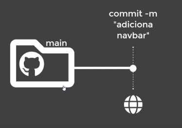
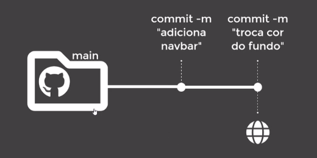
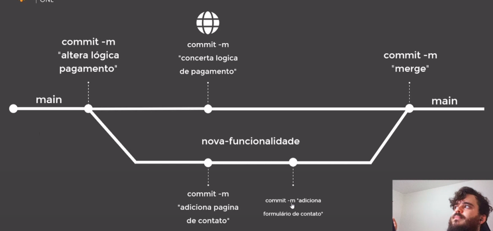

# :back: [README](../../../README.md#version-control-systems)

<h1 align="center">
    Fundamentos git
</h1> 

 

# Objetos fundamentais
-   Blobs
    -   São a estrutura básica.

    

-   Trees
    -   Armazenam blobs ou outras trees.

    
    
    

-   Commits
    -   Une os blobs e as trees.

    

Visão geral da estrutura acima:

  

# Ciclo de vida do git

  

# Resolução de conflitos
Um conflito ocorre quando duas pessoas alteram a mesma linha de código de um mesmo arquivo versionado pelo git.
Ao tentar subir a versão local para o repositório remoto, o git irá informar que existem divergencias e irá pedir para que um fetch + merge (pull) seja feito, daí o programador irá resolver essas diferenças e ai sim um push poderá ser feito com a nova versão que contêm a versão diferente, a versão local e a versão resolvida.

 
 

# Branches (ramificações)
Branches, como nome ja diz, são as ramificações dentro de um git flow.

 

## Tag HEAD
A tag HEAD é "onde você se encontra" dentro do mapa de ramificações do git. Sevindo assim como um indicativo que aponta para o local onde você esta observando o espaço git "agora". A tag HEAD, normalmente, aponta para o último commit válido da branch que você está navegando no momento "atual". 

## Main / Master
É o nome dado a "pasta" principal do git e também a branch central de um projeto git.

Cada novo commit na branch atualiza a tag HEAD dessa branch, ou seja, o último commit atualiza a versão atual do repositporio para si mesmo. dar um commit na branch "main" significa atualizar a versão desta branch. Veja abaixo:

 

## Comportamento das ramificações
É possível trabalhar com diversas ramificações (branches) ao mesmo tempo e também é possível inserir branches em outras branches basta fazer um merge.

