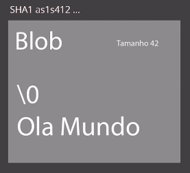
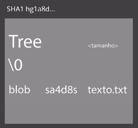
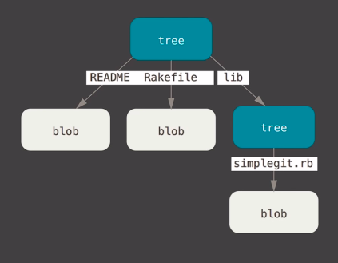
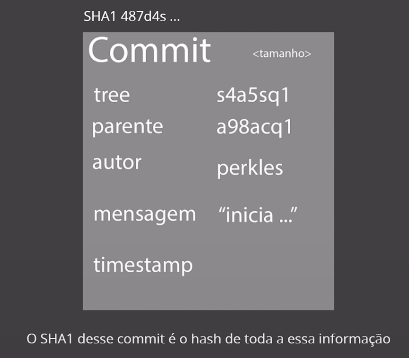
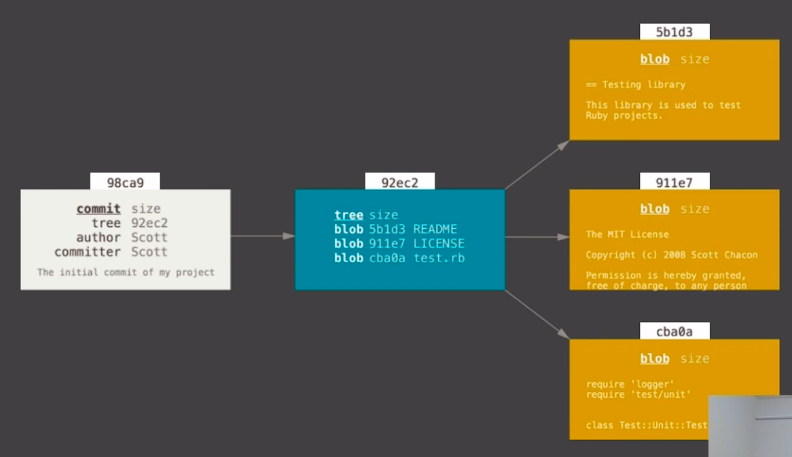
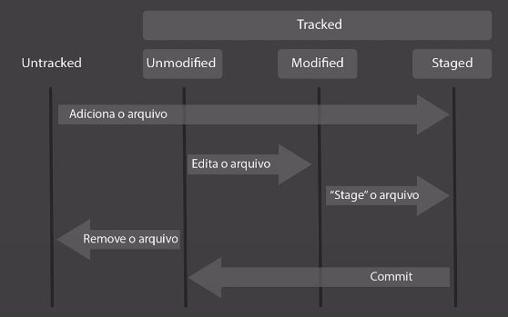

# :back: [README](../../../README.md#version-control-systems)

<h1 align="center">
    Fundamentos git
</h1> 

 

# Objetos fundamentais
-   Blobs
    -   São a estrutura básica.

    

-   Trees
    -   Armazenam blobs ou outras trees.

    
    
    

-   Commits
    -   Une os blobs e as trees.

    

Visão geral da estrutura acima:

  

# Ciclo de vida do git

  

# Resolução de conflitos
Um conflito ocorre quando duas pessoas alteram a mesma linha de código de um mesmo arquivo versionado pelo git.
Ao tentar subir a versão local para o repositório remoto, o git irá informar que existem divergencias e irá pedir para que um fetch + merge (pull) seja feito, daí o programador irá resolver essas diferenças e ai sim um push poderá ser feito com a nova versão que contêm a versão diferente, a versão local e a versão resolvida.

