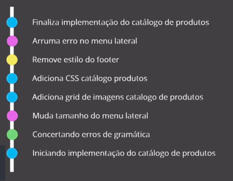
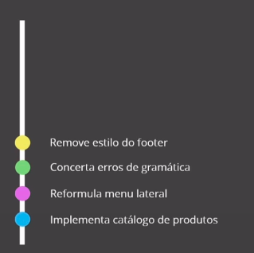

# :back: [README](../../../README.md#version-control-systems)

<h1 align="center">
    Fundamentos git
</h1> 

 

# Objetos fundamentais
-   Blobs
    -   São a estrutura básica.

    

-   Trees
    -   Armazenam blobs ou outras trees.

    
    
    

-   Commits
    -   Une os blobs e as trees.

    

Visão geral da estrutura acima:

  

# Ciclo de vida do git

 

## Working directory
É o repositório no qual estamos trabalhando. Nele estão os arquivos de todos os status (**Untracked**, **Staged**, **Modified**, **Unmodified**).

Porém os arquivos com status "**Untracked**" encontram-se apenas no working directory.

 

### Untracked ( U )
Quando acabarmos de criar um arquivo ou pasta dentro de um diretório de trabalho, o mesmo se encontrará com o status de "**Untracked**", ou seja, não estará sendo "monitorado" pelo repositório git, visto que nem o adicionamos ao repo ainda.

No VSCode vemos a letra "**U**" na frente de todo arquivo dentro de um repositório com o status "**Untracked**".

 

## Staging / Index ( A )
Toda vez que um arquivo ou pasta em status "**Untracked**" ou "**Modified**" é adicionado ao repositório (`git add`), eles passam a ter o status de "**Staged**". Isso quer dizer que ele é "formatado/preparado" para se integrar posteriormente aos arquivos da nossa branch por meio do comando `git commit` e também quer dizer que este agora está sendo monitorado pelo nosso repositório.

No VSCode vemos a letra "**A**" na frente de todo arquivo dentro de um repositório com o status "**Staged**".

 

### Modified ( M )
Toda vez que um arquivo que já foi commitado e está com o status "**Unmodified**" for modificado, este passará a ter o status "**Modified**"

No VSCode vemos a letra "**M**" na frente de todo arquivo dentro de um repositório com o status "**Modified**".

 

## Branch MAIN ( commit )
Um arquivo ou pasta só é definitivamente integrado a um repositório git após ser commitado. No momento logo após seu commit este estará com o status "**Unmodified**".

  

# Resolução de conflitos
Um conflito ocorre quando duas pessoas alteram a mesma linha de código de um mesmo arquivo versionado pelo git.
Ao tentar subir a versão local para o repositório remoto, o git irá informar que existem divergencias e irá pedir para que um fetch + merge (pull) seja feito, daí o programador irá resolver essas diferenças e ai sim um push poderá ser feito com a nova versão que contêm a versão diferente, a versão local e a versão resolvida.

 
 

# Branches (ramificações)
Branches, como nome ja diz, são as ramificações dentro de um git flow.

 

## Tag HEAD
A tag HEAD é "onde você se encontra" dentro do mapa de ramificações do git. Sevindo assim como um indicativo que aponta para o local onde você esta observando o espaço git "agora". A tag HEAD, normalmente, aponta para o último commit válido da branch que você está navegando no momento "atual". 

## Main / Master
É o nome dado a "pasta" principal do git e também a branch central de um projeto git.

Cada novo commit na branch atualiza a tag HEAD dessa branch, ou seja, o último commit atualiza a versão atual do repositporio para si mesmo. dar um commit na branch "main" significa atualizar a versão desta branch. Veja abaixo:

 

## Comportamento das ramificações
É possível trabalhar com diversas ramificações (branches) ao mesmo tempo e também é possível inserir branches em outras branches basta fazer um merge.

 

## Stash
Quando estamos em uma branch, é interessante que não carreguemos arquivos de uma branch para outra, dessa forma o stash nos auxilia à se movimentar de forma limpa, sem carregar arquivos de uma branch para outra. 

 
 

# Histórico de um repositório git
Para ter informações de histórico precisamos do comando `git log` apenas. Claro que este comando será utilizado com outros recursos para retornar resultados mais específicos.

 

## Ferramentas GUI
https://git-scm.com/downloads/guis

 

## Reverções em git
Existem diversos comandos com a finalidade de reverter alguma ação no git. É necessário entende-los corretamente para usá-los de forma mais objetiva.

 
 

# Commit
Um bom commit deve ser **atômico**, **Ser em uma Língua apenas** (se não é um trabalho internacional, não tem porquê estar em inglês por exemplo),  

 

## Atomicidade
Deve fazer algo específico, apenas uma coisa. Observe abaixo como os itens de cores iguais puderam ser agrupados:

Antes:

Depois:

 

## Conventional Commmit
A especificação do Conventional Commmit é uma convenção simples para utilizar nas mensagens de commit. Ela define um conjunto de regras para criar um histórico de commit explícito, o que facilita a criação de ferramentas automatizadas baseadas na especificação. Esta convenção se encaixa com o SemVer, descrevendo os recursos, correções e modificações que quebram a compatibilidade nas mensagens de commit.

### Versionamento semântico

Ex.: versão 3.2.7

-   3 (MAJOR, MAIOR, GRANDE)
    -   Muda a compatibilidade;
-   2 (MINOR, MENOR, PEQUENA)
    -   Implementa uma funcionalidade mas não há quebra de compatibilidade;
-   7 (PATCH, FRAGMENTO)
    -   Correções do dia-a-dia, como a correção de um bug por exemplo;

 

## Linguagem
Faça commits em uma única linguagem e se seu projeto está numa equipe que não fala nativamente uma língua, não é necessário escrevê-lo fora da língua nativa.

 

## Estrutura de um commit
Um commit tem **Assunto**, **Corpo**, **Rodapé**.

 

### Assunto
-   Curto e compreensivo; 
-   Até 50 caractéres;
-   Começar com letra maiúscula;
-   Não terminar em ponto;
-   Escrito de forma imperativa;
    -   Em inglês use o Imperative mood:
        -   Add a feature X Added a feature
        -   Modify an existing feature X Modified an existing feature
        -   Remove a feature X Removed a feature
        -   If applied, this commit will...
            -   If applied, this commit will add payment integration;
            -   If applied, this commit will update database configuration;
            -   If applied, this commit will remove redundant code;
    -   Em português use a forma imperativa:
        -   Adiciona a funcionalidade tal X Funcionalidade tal adicionada
        -   Modifica uma funcionalidade existente X Funcionalidade tal modificada
        -   Remove a funcionalidade tal X Funcionalidade tal removida
        -   Se aceito, esse commit...
            -   Se aceito, esse commit adiciona método de pagamento
            -   Se aceito, esse commit atualiza configurações do banco de dados
            -   Se aceito, esse commit remove código redundante

 

### Corpo
-   Adicione detalhes ao commit;
-   Tente quebrar a linha em 75 caracteres;
-   Identifique sua audiência;
-   Explique tudo;
-   Use markdown;

 

### Rodapé
-   Referencie assuntos relacioandos;
    -   Ex.: Referenciar um issue num rodapé de um commit. ("Closes #2", fecha uma issue de #2 por exemplo);

