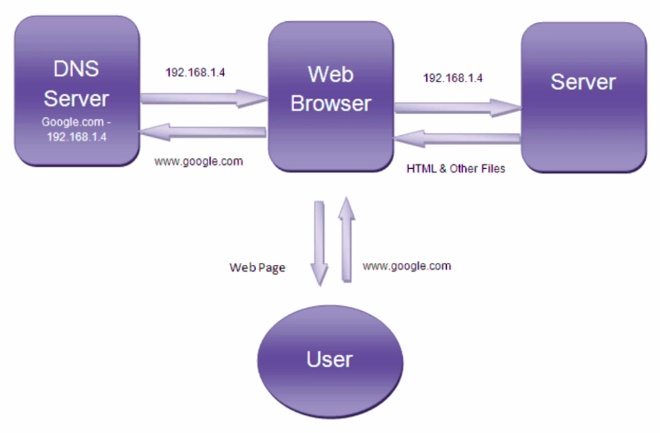

# :back: [README](../../../README.md#web-development)

<h1 align="center">
    Funcionamento da internet
</h1> 

 

A INTERNET 
* É uma rede global de computadores.
* Cada computador/roteador tem um Endereço IP (73.158.6.61).
* Computadores conversam entre si utilizando o protocolo TCP/IP.
* O protocolo HTTP lida com o tráfego web entre browsers e servidores web através de requests e responses. É chamado de application layer protocol e roda sobre o protocolo TCP.
* HTTPS é utilizado para conexões seguras, utiliza certificados SSL e afins para tal propósito.
* Existem outros tipos de protocolos.
* Websites/Webpages são arquivos armazenados em computadores com a finalidade de rodar um pedaço de software chamado web server (Apache, Nginx, etc).
* Hosting Companies provêm espaços num servidor próprio para o armazenamento de websites de terceiros.
* Domain Names podem ser comprados e ligados à web servers.
* O DNS é utilizado para mapear os Domain Names, relacionando-os também aos seus respectivos endereços IP.

Abaixo uma imagem para representar, de forma simples, esta relação:

Ao pensar no design de uma aplicação web, por exemplo, terá que considerar fatores como a latência da rede, a geolocalização dos servidores, a velocidade e/ou disponibilidade de conexão dos usuários, etc.

Modelos primordiais:
1. `Cliente & Servidor`
    - Você precisa entender esse modelo para entender como o software que você irá desenvolver se encaixa nele. 

> O `www` é uma tecnolçogia e significa **world wide web**.

A estrutura da internet é dividida entre:
* Softwares
    - Responsáveis por gerenciar os dados e garantir que eles cheguem ao seu destino de forma segura.
* Hardwares
    - Gerenciam o envio e o recebimento das informações e fazem as ligações físicas entre equipamentos e computadores atravez de cabos e sinais que interligam o mundo todo.

Para que a comunicação funcione é preciso transformar a informação que sai do provedor de internet em um sinal gerenciável. Na maioria das residências comuns o **modem** cumpre este papel.

O **roteador** cria rotas, distribui a conexão e garante que os dados transferidos via internet cheguem aos seus destinos.

Para enviar uma mensagem por celular por exemplo:
1. O celular envia uma mensagem para os servidores e roteadores do serviço de telefonia.
2. Que encaminha para os servidores e roteadores do serviço de mensagem (whatsapp, Telegram, Tinder).
3. Que encaminha para o modem que o celular da pessoa para qual a mensagem foi enviada está conectada.

## IP (Internet Protocol)
O IP é um número identificador, como se fosse nosso CPF ou RG, dado ao seu computador ou roteador, ao conectar-se à rede. É através desse número que seu computador pode enviar e receber dados na internet. Normalmente, o IP é definido pelo seu provedor de Internet.

Para que não seja necessário decorar números IP, foram criados os nomes de domínio (Domain Names). Dessa forma procuramos por `www.youtube.com` e não por `142.250.78.238`, que é o IP que nos leva ao endereço do Youtube.

> Pelo teminal do linux é possível dar o comando <a name="ping">[ping](../../lowLevelProgramming/unixBasedOS/terminalCheatSheet.md#ping)</a> para ver detalhes sobre um site, inclusive o IP.

## Peças da internet
* **Cliente**
    - Firefox, Mozilla, Chrome são, em termo técnico, o **cliente** . O cliente é uma aplicação que está conectada à Internet. A sua principal função é receber a interação do usuário e traduzi-la em uma requisição para outro computador chamado Servidor Web. Apesar de usarmos o navegador para acessar à Internet, você pode pensar no seu computador como sendo o Cliente no modelo Cliente-Servidor. Todo computador tem um número único, como o seu CPF, chamado endereço IP. É através desse endereço que computadores, celulares e tablets são identificados.
* **Servidor**
    - Como vimos no exemplo acima, nossa busca por www.google.com será enviada para um Servidor . O Servidor é um super computador conectado à Internet. Ele também tem o seu próprio endereço IP, assim como o seu computador. O Servidor espera por requisições de outras máquinas (clientes). Diferente do seu computador, um Servidor tem um software específico em execução que irá dizer como ele deve responder a uma requisição do seu navegador. A principal função do Servidor é armazenar, processar e entregar páginas web para os Clientes. Há diversos tipos de servidores, como:
        - Web Servers
        - Database Servers
        - File Servers
        - Application Servers
        - Web Server (É o servidor que usamos para fazer a busca por www.google.com)
* **Endereço IP**
    - A sigla IP refere-se a **Internet Protocol**. O endereço IP é um identificador numérico para um dispositivo (computador, celular, tablet, impressora, roteador, servidor...) conectado à rede TCP/IP. Todo dispositivo conectado à Internet tem um endereço IP único que irá identificá-lo, e será usado para comunicar com outros dispositivos. Os endereços IP tem quatro campos de dígitos separados por pontos (exemplo: 244.155.65.2). Esses números são chamados de endereço lógico. Para localizar um dispositivo conectado à Internet o endereço lógico é convertido em um endereço físico por um software. Esse endereço físico faz parte do seu hardware e é conhecido por endereço de controle de acesso à mídia (MAC address).
    > Um protocolo é um conjunto de regras
* **TCP/IP**
    - Essa sigla refere-se à **Transmission Control Protocol / Internet Protocol**. O protocolo TCP/IP é utilizado para transmitir dados na rede. Ele também é o protocolo de comunicação mais utilizado no mundo Web.
* **ISP**
    - ISP ou **Internet Service Provider** é o seu provedor de Internet. É qualquer empresa que nos fornece acesso ao maravilhoso mundo Web. Sem os seus serviços, não conseguiríamos fazer a nossa busca por www.google.com pois não estaríamos conectados à Internet.
* **DNS**
    - DNS ou **Domain Name System** é um dispositivo com uma base de dados distribuída que gerencia os nomes de serviços, computadores ou qualquer dispositivo conectado à Internet. Ele é usado para relacionar o endereço nominal (google.com) com o endereço IP (172.217.30.4). Os servidores DNS são responsáveis por localizar e traduzir para números (um endereço IP) as buscas por sites que digitamos no navegador.
* **Port Number**
    - O número de porta é um número de 16 bits utilizado para identificar uma porta específica no servidor, e está **sempre associado ao endereço IP**. 
    > O Port number é uma forma de identificar um processo específico encaminhado para o servidor.
* **Host**
    - O Host (Hospedeiro/Anfitrião) é qualquer computador conectado à rede, seja como cliente, servidor ou qualquer outro tipo de dispositivo. Cada host tem um endereço IP único. Para o site que estamos buscando, www.google.com , o host é o servidor web que hospeda a página na web. É comum confundir o host com o servidor. Lembre-se que eles são coisas diferentes! O Servidor é um tipo de host - uma máquina específica com endereço IP. Por outro lado, o host pode ser também uma organização inteira que fornece um serviço de hospedagem para manter inúmeros servidores web.
* **HTTP**
    - **Hyper-text Transfer Protocol** é o protocolo utilizado para a comunicação entre navegadores e servidores na Internet.
    > Ambos, cliente e servidor, enviam requisições HTTP via TCP/IP.

    > Porta padrão HTTP: 80

    > Porta padrão HTTPS: 443
* **URL**
    - O URL é a sigla para **Uniform Resource Locators** e identifica um recurso web específico. Podemos, como exemplo, mudar a nossa busca para https://www.google.com/travel/flights para pesquisar por preços de passagens aéreas. O URL identifica o protocolo que será utilizado para comunicarmos com o servidor (https), o nome do host (google.com) e o recurso que queremos acessar (travel/flights).
* **Pacotes**
    - São pequenas unidades de informação que são transmitidas pela rede quando um cliente faz uma requisição.
* **Engine de renderização**
    - Recurso utilizado pelos navegadores para conseguir montar as páginas web.
* **DOM**
    - O **Modelo de Objeto de Documento** é uma forma de representar os elementos HTML em forma de árvore.

